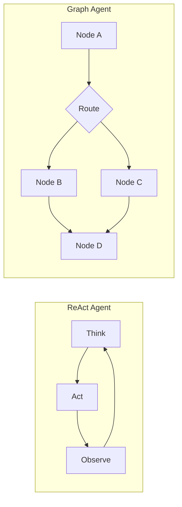
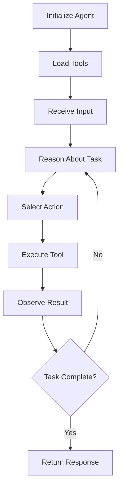

# Agents

Agents are the core intelligence layer of SpoonOS—**autonomous AI systems that reason, plan, and act** to accomplish complex tasks. An agent combines an LLM's reasoning capabilities with tools, memory, and structured execution patterns to go beyond simple question-answering.

## Why Agents?

A raw LLM can answer questions, but it can't:

- **Take actions** — Call APIs, query databases, execute transactions
- **Remember context** — Maintain state across conversations and sessions
- **Reason iteratively** — Break down complex tasks into steps, observe results, and adapt
- **Handle failures** — Retry, fallback, or ask for help when something goes wrong

SpoonOS agents solve these problems with two execution models:



| Model | Best For | How It Works |
|-------|----------|--------------|
| **ReAct** | Simple tasks, single-step tool calls, Q&A | Think → Act → Observe loop until done |
| **Graph** | Complex workflows, parallel tasks, conditional logic | Stateful graph with nodes, edges, and routing |

## What Can You Build?

| Use Case | Agent Type | Example |
|----------|------------|---------|
| **Chatbot with tools** | ReAct | Answer questions by searching the web or querying APIs |
| **Trading bot** | Graph | Analyze market → decide action → execute trade → monitor |
| **Research assistant** | Graph | Gather sources → summarize → synthesize → format report |
| **Customer support** | ReAct | Handle tickets by querying knowledge base and escalating |
| **Portfolio tracker** | Graph | Fetch prices → calculate metrics → generate alerts |

## SpoonOS vs Other Frameworks

| Feature | SpoonOS | LangChain | AutoGPT |
|---------|---------|-----------|---------|
| **Execution** | ReAct + Graph workflows | ReAct variants | Autonomous loop |
| **Tools** | `BaseTool` + MCP protocol | `Tool` class | Plugins |
| **Memory** | Built-in short-term + Mem0 | External modules | File-based |
| **Providers** | Unified multi-provider with fallback | Per-model adapters | Single provider |
| **Web3/Crypto** | Native CEX, DEX, on-chain toolkits | Third-party only | Limited |

---

## Quick Start

```bash
pip install spoon-ai
export OPENAI_API_KEY="your-key"
```

```python
import asyncio
from spoon_ai.agents import SpoonReactAI
from spoon_ai.chat import ChatBot

agent = SpoonReactAI(llm=ChatBot(model_name="gpt-5.1-chat-latest", llm_provider="openai"))

async def main():
    response = await agent.run("What is the capital of France?")
    print(response)

asyncio.run(main())
```

---

## Agent Types

### ReAct Agents

ReAct (Reasoning + Acting) agents follow a thought → action → observation loop. The agent thinks about what to do, executes a tool or generates a response, observes the result, and repeats until the task is complete.

```python
import os
from spoon_ai.agents import SpoonReactAI
from spoon_ai.chat import ChatBot
from spoon_ai.tools import ToolManager
from spoon_ai.tools.base import BaseTool
from spoon_ai.tools.mcp_tool import MCPTool
import asyncio
class PercentageTool(BaseTool):
    name: str = "calculate_percentage"
    description: str = "Calculate a percentage of a numeric value"
    parameters: dict = {
        "type": "object",
        "properties": {
            "value": {"type": "number", "description": "Base value"},
            "percent": {"type": "number", "description": "Percentage to apply (e.g., 10 for 10%)"},
        },
        "required": ["value", "percent"],
    }

    async def execute(self, value: float, percent: float) -> str:
        return str(value * percent / 100)

# MCP web search tool (requires TAVILY_API_KEY)
tavily_search = MCPTool(
    name="tavily-search",
    description="Search the web for current information",
    mcp_config={
        "command": "npx",
        "args": ["-y", "tavily-mcp"],
        "env": {"TAVILY_API_KEY": os.getenv("TAVILY_API_KEY")},
    },
)

# Agent with real tools
agent = SpoonReactAI(
    llm=ChatBot(model_name="gpt-5.1-chat-latest", llm_provider="openai"),
    tools=ToolManager([tavily_search, PercentageTool()]),
    max_iterations=10  # Limit reasoning loops
)

async def main():
    # Pre-load MCP tool parameters so LLM can see the correct schema
    await tavily_search.ensure_parameters_loaded()
    print("MCP tool parameters loaded")
    response = await agent.run("Search Bitcoin price and calculate 10% of it")
    print(response)

asyncio.run(main())
```

**Best for:** Single-step tasks, API calls, Q&A, simple automation.

### Graph Agents

Graph agents execute structured workflows defined as state graphs, supporting conditional branching, parallel execution, and complex multi-step pipelines.

**Basic Usage:**

```python
from spoon_ai.graph import StateGraph, START, END, GraphAgent

# Build workflow
graph = StateGraph(MyState)
graph.add_node("analyze", analyze_fn)  # Node function
graph.add_node("execute", execute_fn)  # Node function
graph.set_entry_point("analyze")
graph.add_conditional_edges("analyze", router_fn, {
    "execute": "execute",
    "skip": "skip_execution"
})

# Create agent
agent = GraphAgent(
    name="market_agent",
    graph=graph
)

result = await agent.run("Analyze market and execute trades")
```

**Node Functions:**
- `analyze_fn(state)`: Receives current state, returns updated state dict
- `execute_fn(state)`: Receives state with analysis results, returns execution results
- `router_fn(state)`: Returns next node name as string for conditional routing

> 📖 **See complete example:** [`examples/intent_graph_demo.py`](https://github.com/XSpoonAi/spoon-core/blob/main/examples/intent_graph_demo.py) for full implementation including state schema, node functions, and error handling.
```

**Best for:** Multi-step workflows, conditional logic, parallel tasks, human-in-the-loop.

---

## Agent Architecture

### Core Components

1. **LLM Provider** - The language model powering the agent
2. **Tool Manager** - Manages available tools and execution
3. **Memory System** - Stores conversation history and context
4. **Prompt System** - Handles system prompts and instructions

### Agent Lifecycle



## Creating Custom Agents

### Basic Agent Setup

```python
from spoon_ai.agents.base import BaseAgent
from spoon_ai.tools import ToolManager

class CustomAgent(BaseAgent):
    def __init__(self, llm, tools=None):
        super().__init__(llm)
        self.tool_manager = ToolManager(tools or [])

    async def run(self, message: str) -> str:
        # Custom agent logic here
        return await self.process_message(message)
```

### Agent Configuration

```python
import os
import asyncio
from dotenv import load_dotenv
from spoon_ai.agents.spoon_react_mcp import SpoonReactMCP
from spoon_ai.tools import ToolManager
from spoon_ai.tools.mcp_tool import MCPTool
from spoon_ai.chat import ChatBot
from spoon_toolkits.crypto.crypto_powerdata.tools import CryptoPowerDataCEXTool

# Install extra dependency: pip install spoon-toolkits
load_dotenv()

class SpoonMacroAnalysisAgent(SpoonReactMCP):
    name: str = "SpoonMacroAnalysisAgent"
    system_prompt: str = (
        "You are a crypto market analyst. Use tavily-search for news and "
        "crypto_power_data_cex for market data, then deliver a concise macro view."
    )

    def __init__(self, **kwargs):
        super().__init__(**kwargs)
        self.available_tools = ToolManager([])

    async def initialize(self):
        tavily_key = os.getenv("TAVILY_API_KEY")
        if not tavily_key:
            raise Val ueError("Set TAVILY_API_KEYbefore running the agent.")

        tavily_tool = MCPTool(
            name="tavily-search",
            description="Web search via Tavily",
            mcp_config={
                "command": "npx",
                "args": ["--yes", "tavily-mcp"],
                "env": {"TAVILY_API_KEY": tavily_key},
            },
        )

        # Pre-load MCP tool parameters
        await tavily_tool.ensure_parameters_loaded()

        crypto_tool = CryptoPowerDataCEXTool()
        self.available_tools = ToolManager([tavily_tool, crypto_tool])


async def main():
    print("--- SpoonOS Macro Analysis Agent Demo ---")
    agent = SpoonMacroAnalysisAgent(
        llm=ChatBot(llm_provider="gemini", model_name="gemini-2.5-flash")
    )
    await agent.initialize()

    query = (
        "Perform a macro analysis of Bitcoin (BTC). "
        "Search for recent news and get current market data from Binance using BTC/USDT pair."
    )
    print(f"\nRunning query: {query}")
    response = await agent.run(query)
    print(f"\n--- Analysis Complete ---\n{response}")


if __name__ == "__main__":
    asyncio.run(main())
```

## Best Practices

### Tool Selection
- Choose tools that match your use case
- Avoid tool overload - too many tools can confuse the agent
- Test tool combinations thoroughly

### Prompt Engineering
- Provide clear, specific instructions
- Include examples of desired behavior
- Set appropriate constraints and guidelines

### Error Handling

- Leverage framework's automatic retry mechanisms
- Use built-in fallback strategies
- Rely on framework's structured error handling

### Framework Error Handling

SpoonOS agents benefit from built-in error resilience:

```python
# Framework handles errors automatically
# Requires: pip install spoon-toolkits
from spoon_ai.tools import ToolManager
from spoon_toolkits.crypto.crypto_powerdata.tools import CryptoPowerDataCEXTool

agent = SpoonReactAI(
    llm=ChatBot(model_name="gpt-5.1-chat-latest", llm_provider="openai"),
    tools=ToolManager([CryptoPowerDataCEXTool()])  # real tool with retries/failures
)

# Automatic handling includes:
# - LLM provider failures with fallback
# - Tool execution errors with retry
# - Network issues with graceful degradation
response = await agent.run("Get Bitcoin price and analyze trends")
```

## Performance Considerations

### Memory Usage
- ReAct agents: Lower memory footprint
- Graph agents: Higher memory for complex workflows

### Execution Speed
- Simple tasks: ReAct agents are faster
- Complex workflows: Graph agents are more efficient

### Scalability
- ReAct: Better for high-frequency, simple tasks
- Graph: Better for complex, long-running processes

## Next Steps

### 📚 **Agent Implementation Examples**

#### 🎯 [Intent Graph Demo](../examples/intent-graph-demo.md)
**GitHub**: [View Source](https://github.com/XSpoonAi/spoon-core/blob/main/examples/intent_graph_demo.py)

**What it demonstrates:**
- Complete Graph agent implementation with intelligent routing
- Long-lived agent architecture with persistent memory
- Advanced state management and context preservation
- Production-ready error handling and recovery

**Key features:**
- Dynamic query routing based on user intent (general_qa → short_term_trend → macro_trend → deep_research)
- True parallel execution across multiple data sources
- Memory persistence and conversation context
- Real-time performance monitoring and metrics

**Best for learning:**
- Graph agent architecture patterns
- Long-running process management
- Advanced memory and state handling
- Production deployment considerations

#### 🔍 [MCP Spoon Search Agent](../examples/mcp-spoon-search-agent.md)
**GitHub**: [View Source](https://github.com/XSpoonAi/spoon-core/blob/main/examples/mcp/spoon_search_agent.py)

**What it demonstrates:**
- MCP-enabled agent with dynamic tool discovery
- Web search integration with cryptocurrency analysis
- Multi-tool orchestration and data synthesis
- Real-world agent deployment patterns

**Key features:**
- Tavily MCP server integration for web search
- Crypto PowerData tools for market analysis
- Unified analysis combining multiple data sources
- Dynamic tool loading and validation

**Best for learning:**
- MCP protocol implementation
- Multi-tool agent architecture
- Real-time data integration patterns
- Error handling in distributed systems

#### 📊 [Graph Crypto Analysis](../examples/graph-crypto-analysis.md)
**GitHub**: [View Source](https://github.com/XSpoonAi/spoon-core/blob/main/examples/graph_crypto_analysis.py)

**What it demonstrates:**
- Specialized cryptocurrency analysis agent
- LLM-driven decision making throughout the workflow
- Real-time market data processing and analysis
- Investment recommendation generation

**Key features:**
- Real Binance API integration (no simulated data)
- Technical indicator calculation (RSI, MACD, EMA, Bollinger Bands)
- Multi-timeframe analysis and correlation
- Risk assessment and market sentiment analysis

**Best for learning:**
- Domain-specific agent development
- Financial data processing patterns
- LLM-driven workflow automation
- Real API integration in agents

### 🛠️ **Development Guides**

- **[Tools System](./tools.md)** - Complete guide to available tools and integrations
- **[LLM Providers](./llm-providers.md)** - Configure and optimize language models
- **[Build Your First Agent](../how-to-guides/build-first-agent.md)** - Step-by-step agent development tutorial

### 📖 **Advanced Topics**

- **[Graph System](../graph-system/index.md)** - Advanced workflow orchestration
- **[MCP Protocol](../core-concepts/mcp-protocol.md)** - Dynamic tool discovery and execution
- **[API Reference](../api-reference/spoon_ai/agents/base/)** - Complete agent API documentation
