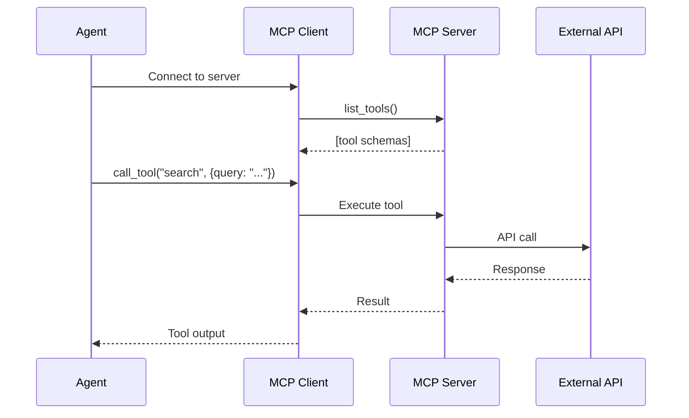
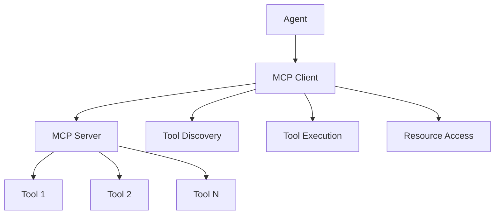

# MCP Protocol

The **Model Context Protocol (MCP)** is an open standard for connecting AI agents to external tools and data sources. Instead of hardcoding tool integrations, agents discover tools dynamically at runtime—enabling modular, federated ecosystems where tools can be shared across different AI applications.

## Why MCP?

Traditional tool integration is brittle:

```text
❌ Old way: Agent ↔ Hardcoded Tool A ↔ Hardcoded Tool B ↔ Hardcoded Tool C
✅ MCP way: Agent ↔ MCP Client ↔ Any MCP Server (tools discovered at runtime)
```

With MCP, your agent can:

- **Discover tools dynamically** — No code changes when tools are added or updated
- **Connect to any MCP server** — Use tools from Cursor, Claude Desktop, or custom servers
- **Share tools across apps** — One MCP server can serve multiple agents
- **Hot-reload** — Update tool definitions without redeploying

## How It Works



| Concept | Description |
|---------|-------------|
| **MCP Server** | Exposes tools via a standard protocol. Can run as subprocess (stdio), HTTP/SSE, or WebSocket. |
| **MCP Client** | Connects to servers, discovers tools, and executes them on behalf of agents. |
| **Tool Schema** | JSON-schema definition of tool name, description, and parameters—fetched at runtime. |
| **Resources** | Optional: MCP also supports resource URIs for documents, databases, and other data. |

## MCP vs Other Approaches

| Aspect | MCP | OpenAI Plugins | Hardcoded Tools |
|--------|-----|----------------|-----------------|
| **Discovery** | Runtime `list_tools()` | Manifest file at URL | Compile-time |
| **Transport** | stdio, SSE, WebSocket | HTTPS only | In-process |
| **Ecosystem** | Cursor, Claude, SpoonOS, etc. | ChatGPT only | Single app |
| **Updates** | Hot-reload, no redeploy | Redeploy plugin | Redeploy app |

---

## Quick Start

```bash
pip install spoon-ai
```

### Using MCP Tools with an Agent

The recommended way to use MCP tools is through `SpoonReactMCP`:

```python
"""
DeepWiki MCP Agent Demo - demonstrates how to use MCP tools with SpoonReactMCP agent.
"""
import asyncio
from spoon_ai.agents.spoon_react_mcp import SpoonReactMCP
from spoon_ai.tools.mcp_tool import MCPTool
from spoon_ai.tools.tool_manager import ToolManager
from spoon_ai.chat import ChatBot

class DeepWikiAgent(SpoonReactMCP):
    """Agent that can analyze GitHub repositories via DeepWiki MCP"""
    name: str = "DeepWikiAgent"
    system_prompt: str = """You are a helpful assistant that can analyze GitHub repositories using DeepWiki.
When asked about a repository, use the read_wiki_structure tool with the repoName parameter.
For example, if asked about "XSpoonAi/spoon-core", call read_wiki_structure with repoName="XSpoonAi/spoon-core".
Always use the tool to get information about repositories before answering questions."""

    def __init__(self, **kwargs):
        super().__init__(**kwargs)
        self.available_tools = ToolManager([])

    async def initialize(self):
        # Create MCP tool for DeepWiki (no API key needed!)
        # Important: Use the actual tool name from the server: "read_wiki_structure"
        deepwiki_tool = MCPTool(
            name="read_wiki_structure",  # Use actual tool name, not "deepwiki"
            description="Analyze GitHub repositories and get their structure and documentation",
            mcp_config={
                "url": "https://mcp.deepwiki.com/sse",
                "transport": "sse",
                "timeout": 30,
            }
        )
        # Pre-load parameters so LLM can see the correct schema
        await deepwiki_tool.ensure_parameters_loaded()
        self.available_tools = ToolManager([deepwiki_tool])

async def main():
    # Create and initialize agent
    agent = DeepWikiAgent(
        llm=ChatBot(
            llm_provider="openai", 
            model_name="gpt-5.1-chat-latest"  
        )
    )
    
    print("Initializing agent and loading MCP tool...")
    await agent.initialize()
    # Query the agent with a clear request
    query = "What is XSpoonAi/spoon-core about? Please analyze the repository and summarize its purpose."
    response = await agent.run(query)
    print("\n Response:")
    print(response)

if __name__ == "__main__":
    asyncio.run(main())
```

### Direct MCP Tool Usage

For direct MCP tool calls without an agent:

```python
import asyncio
from spoon_ai.tools.mcp_tool import MCPTool

# Connect to an SSE/HTTP MCP server
mcp_tool = MCPTool(
    name="read_wiki_structure",
    description="DeepWiki MCP tool for repository analysis",
    mcp_config={
        "url": "https://mcp.deepwiki.com/sse",
        "transport": "sse",
        "timeout": 30,
        "headers": {"User-Agent": "SpoonOS-MCP/1.0"}
    }
)

async def main():
    # Tool parameters are loaded lazily when first used
    await mcp_tool.ensure_parameters_loaded()

    # Call the tool
    result = await mcp_tool.execute(repo="XSpoonAi/spoon-core")
    print(result)

asyncio.run(main())
```

---

## Architecture



### MCP Components

1. **MCP Server** - Hosts tools and resources
2. **MCP Client** - Connects agents to servers
3. **Tools** - Executable functions with defined schemas
4. **Resources** - Data sources and content

## Connecting to MCP Servers (client-only)

The cookbook focuses on MCP **clients**. Use `MCPTool` to connect to any MCP server (stdio/HTTP/SSE/WS). Hosting servers is out of scope here—follow your chosen server’s docs.

### MCP Client Configuration

SpoonOS supports multiple MCP transport types:

#### SSE/HTTP Transport (Remote Servers)

```python
from spoon_ai.tools.mcp_tool import MCPTool

# SSE transport (Server-Sent Events)
sse_tool = MCPTool(
    name="read_wiki_structure",
    description="DeepWiki MCP tool for repository analysis",
    mcp_config={
        "url": "https://mcp.deepwiki.com/sse",
        "transport": "sse",
        "timeout": 30,
        "headers": {"User-Agent": "SpoonOS-MCP/1.0"}
    }
)

# HTTP transport (Streamable HTTP)
http_tool = MCPTool(
    name="read_wiki_structure",
    description="DeepWiki HTTP MCP tool",
    mcp_config={
        "url": "https://mcp.deepwiki.com/mcp",
        "transport": "http",
        "timeout": 30,
        "headers": {"Accept": "application/json"}
    }
)
```

#### Stdio Transport (CLI Tools via npx/uvx)

```python
import os
from spoon_ai.tools.mcp_tool import MCPTool

# NPX transport (Node.js MCP servers)
tavily_tool = MCPTool(
    name="tavily-search",
    description="Web search via Tavily",
    mcp_config={
        "command": "npx",
        "args": ["--yes", "tavily-mcp"],
        "env": {"TAVILY_API_KEY": os.getenv("TAVILY_API_KEY")}
    }
)

# UVX transport (Python MCP servers)
python_tool = MCPTool(
    name="python-mcp",
    description="Python MCP server",
    mcp_config={
        "command": "uvx",
        "args": ["my-python-mcp-server"],
        "env": {}
    }
)

# python transport (Python MCP servers)
python_tool = MCPTool(
    name="python-mcp",
    description="Python MCP server",
    mcp_config={
        "command": "python",
        "args": ["my-python-mcp-server"],
        "env": {}
    }
)
```

#### WebSocket Transport

```python
from spoon_ai.tools.mcp_tool import MCPTool

ws_tool = MCPTool(
    name="ws-mcp",
    description="WebSocket MCP server",
    mcp_config={
        "url": "ws://localhost:8765",  # or wss:// for secure
    }
)
```

## Tool Discovery

### Automatic Discovery

```python
mcp_tool = MCPTool(
    name="discover_tools",  # Temporary name, will be replaced when we discover actual tools
    description="Tool to discover available MCP tools",
    mcp_config={
        "url": "https://mcp.deepwiki.com/sse",
        "transport": "sse",
        "timeout": 30,
    }
)

tools = await mcp_tool.list_available_tools()
for tool in tools:
    tool_name = tool.get('name')
    tool_desc = tool.get('description')
          
```

### Tool Registration

Use `MCPTool` to connect to any MCP server (stdio/HTTP/SSE/WS). No `spoon_cli` imports are needed in cookbook examples.

## Tool Execution

### Direct Execution

```python
# Execute tool 
result = await mcp_tool.call_mcp_tool("get_weather", location="New York"))
result2 = await mcp_tool.execute("get_weather", location="New York"))

print(result)
```

### Agent-Driven Execution

```python
import asyncio
import os
from spoon_ai.agents.spoon_react_mcp import SpoonReactMCP
from spoon_ai.tools.mcp_tool import MCPTool
from spoon_ai.tools.tool_manager import ToolManager
from spoon_ai.chat import ChatBot

class MyMCPAgent(SpoonReactMCP):
    """Custom agent with MCP tools"""
    name: str = "MyMCPAgent"
    system_prompt: str = "You are a helpful assistant with web search capabilities."

    def __init__(self, **kwargs):
        super().__init__(**kwargs)
        self.available_tools = ToolManager([])

    async def initialize(self):
        """Initialize MCP tools"""
        tavily_tool = MCPTool(
            name="tavily-search",
            description="Web search via Tavily",
            mcp_config={
                "command": "npx",
                "args": ["--yes", "tavily-mcp"],
                "env": {"TAVILY_API_KEY": os.getenv("TAVILY_API_KEY")}
            }
        )
        self.available_tools = ToolManager([tavily_tool])

async def main():
    agent = MyMCPAgent(llm=ChatBot(llm_provider="openai", model_name="gpt-5.1-chat-latest"))
    await agent.initialize()

    response = await agent.run("Search for the latest cryptocurrency news")
    print(response)

asyncio.run(main())
```

## Security Considerations

### Authentication

```python
# Use headers for authentication
external_api = MCPTool(
    name="external_api_tool",  # Tool name from the server
    description="External API with Bearer token",
    mcp_config={
        "url": "https://api.example.com/mcp",
        "transport": "http",
        "timeout": 30,
        # Bearer token via headers (not auth config)
        "headers": {
            "Authorization": f"Bearer {os.getenv('MCP_API_TOKEN', 'your_token_here')}",
        }
    }
)
```

### Tool Permissions

```python
# Define tool permissions
class RestrictedTool(BaseTool):
    required_permissions = ["read_data", "write_files"]

    async def execute(self, **kwargs):
        # Check permissions before execution
        if not self.check_permissions():
            raise PermissionError("Insufficient permissions")

        return await self.perform_action(**kwargs)
```

### Input Validation

```python
# Validate tool inputs
class SecureTool(BaseTool):
    async def execute(self, user_input: str) -> str:
        # Sanitize input
        clean_input = self.sanitize_input(user_input)

        # Validate against schema
        if not self.validate_input(clean_input):
            raise ValueError("Invalid input")

        return await self.process(clean_input)
```

## Performance Optimization

### Connection Pooling

> **Note:** `MCPConnectionPool` is not provided by `spoon_ai`. The `MCPClientMixin` already reuses sessions per task; wrap it or your FastMCP client in your own pooling logic if you need cross-server pooling.

```python
If you really need direct control (usually not necessary):

```python
from spoon_ai.agents.mcp_client_mixin import MCPClientMixin
from fastmcp.client.transports import SSETransport

# Create transport object (not string!)
transport = SSETransport(url="https://mcp.example.com/sse")
client = MCPClientMixin(transport)

# MCPClientMixin already pools sessions per task
async with client.get_session() as session:
    tools = await session.list_tools()
    result = await session.call_tool("tool_name", arguments={"param": "value"})

# Sessions are automatically reused within the same task
async with client.get_session() as session:  # Reuses existing session
    tools2 = await session.list_tools()
```

### Caching

> **Note:** `MCPCache` is not included in `spoon_ai`. Use a simple in-memory cache or a library like `functools.lru_cache` for discovery results.

```python
# Minimal in-memory cache for tool discovery
tool_cache: dict[str, list] = {}

async def get_tools_cached():
    if "tools" not in tool_cache:
        tool_cache["tools"] = await mcp_tool.list_available_tools()
    return tool_cache["tools"]
```

### Async Operations

```python
# Execute multiple tools concurrently
import asyncio

async def parallel_execution():
    tasks = [
        mcp_tools.execute_tool("tool1", {"param": "value1"}),
        mcp_tools.execute_tool("tool2", {"param": "value2"}),
        mcp_tools.execute_tool("tool3", {"param": "value3"})
    ]

    results = await asyncio.gather(*tasks)
    return results
```

## Common Use Cases

### API Integration

```python
# Integrate external APIs through MCP
class APITool(BaseTool):
    name = "api_call"

    async def execute(self, endpoint: str, method: str = "GET") -> dict:
        async with aiohttp.ClientSession() as session:
            async with session.request(method, endpoint) as response:
                return await response.json()
```

### Database Access

```python
# Database operations through MCP
class DatabaseTool(BaseTool):
    name = "query_database"

    async def execute(self, query: str) -> list:
        # Execute database query
        return await self.db.execute(query)
```

### File Operations

```python
# File system operations
class FileTool(BaseTool):
    name = "read_file"

    async def execute(self, filepath: str) -> str:
        with open(filepath, 'r') as f:
            return f.read()
```

## Best Practices

### Tool Design

- **Clear naming** - Use descriptive tool names
- **Comprehensive schemas** - Define complete parameter schemas
- **Error handling** - Leverage framework's automatic error handling
- **Documentation** - Provide clear descriptions and examples

### Performance

- **Connection reuse** - Reuse MCP connections when possible
- **Caching** - Cache discovery results and frequently used data
- **Timeouts** - Set appropriate timeouts for tool execution

### Security

- **Input validation** - Always validate tool inputs
- **Authentication** - Implement proper authentication mechanisms
- **Permissions** - Use least-privilege access principles

### Error Handling Philosophy

The SpoonOS framework follows a "fail-fast, recover-gracefully" approach for MCP operations:

- **Automatic Recovery**: Connection failures, timeouts, and server errors are handled automatically
- **Graceful Degradation**: When tools are unavailable, the system provides meaningful fallbacks
- **Minimal Manual Handling**: Let the framework handle errors; only intervene for custom business logic

```python
# Preferred: Let framework handle MCP errors
result = await mcp_tools.execute_tool("weather_tool", {"location": "NYC"})

# Framework automatically handles:
# - Server connection issues
# - Tool discovery failures
# - Execution timeouts
# - Parameter validation errors
```

## Troubleshooting

### Common Issues

#### Connection Errors

The framework automatically handles connection failures with built-in retry mechanisms:

```python
# Framework handles connection failures automatically
await mcp_client.connect()  # Automatic retry with exponential backoff
```

#### Tool Discovery Failures

```python
# Framework provides graceful handling of discovery issues
tools = await mcp_tools.discover_tools()
# Automatic fallback to cached tools if server unavailable
```

#### Execution Timeouts

```python
# Framework manages timeouts automatically
result = await mcp_tools.execute_tool("slow_tool", {})
# Automatic timeout handling with configurable limits
```

## Next Steps

### 📚 **MCP Implementation Examples**

#### 🔍 [MCP Spoon Search Agent](../examples/mcp-spoon-search-agent.md)
**GitHub**: [View Source](https://github.com/XSpoonAi/spoon-core/blob/main/examples/mcp/spoon_search_agent.py)

**What it demonstrates:**
- Complete MCP server integration and tool discovery
- Real-world MCP implementation with Tavily web search
- Dynamic tool loading and orchestration
- Production-ready MCP error handling and recovery

**Key features:**
- Tavily MCP server integration via `npx tavily-mcp`
- Automatic tool discovery and validation
- Seamless integration with existing SpoonOS architecture
- Advanced error handling for MCP server failures

**Learning outcomes:**
- How to initialize and manage MCP servers
- Dynamic tool discovery patterns
- MCP server error handling and recovery
- Integration of MCP tools with LLM workflows

### 🛠️ **Development Resources**

- **[Tools System](./tools.md)** - Learn about the complete tool ecosystem
- **[Custom Tool Development](../how-to-guides/add-custom-tools.md)** - Build MCP-compatible tools
- **[MCP Tool Reference](../api-reference/spoon_ai/tools/)** - MCP-specific tool documentation

### 📖 **Additional Resources**

- **[Graph System](../graph-system/index.md)** - Advanced workflow orchestration
- **[Agent Architecture](../core-concepts/agents.md)** - Agent-MCP integration patterns
- **[API Reference](../api-reference/index)** - Complete SpoonOS API documentation
**GitHub**: [View Source](https://github.com/XSpoonAi/spoon-core/blob/main/examples/mcp/spoon_search_agent.py)

**What it demonstrates:**
- Complete MCP server integration and tool discovery
- Real-world MCP implementation with Tavily web search
- Dynamic tool loading and orchestration
- Production-ready MCP error handling and recovery

**Key features:**
- Tavily MCP server integration via `npx tavily-mcp`
- Automatic tool discovery and validation
- Seamless integration with existing SpoonOS architecture
- Advanced error handling for MCP server failures

**Learning outcomes:**
- How to initialize and manage MCP servers
- Dynamic tool discovery patterns
- MCP server error handling and recovery
- Integration of MCP tools with LLM workflows

### 🛠️ **Development Resources**

- **[Tools System](./tools.md)** - Learn about the complete tool ecosystem
- **[Custom Tool Development](../how-to-guides/add-custom-tools.md)** - Build MCP-compatible tools
- **[MCP Tool Reference](../api-reference/spoon_ai/tools/)** - MCP-specific tool documentation

### 📖 **Additional Resources**

- **[Graph System](../graph-system/index.md)** - Advanced workflow orchestration
- **[Agent Architecture](../core-concepts/agents.md)** - Agent-MCP integration patterns
- **[API Reference](../api-reference/index)** - Complete SpoonOS API documentation
