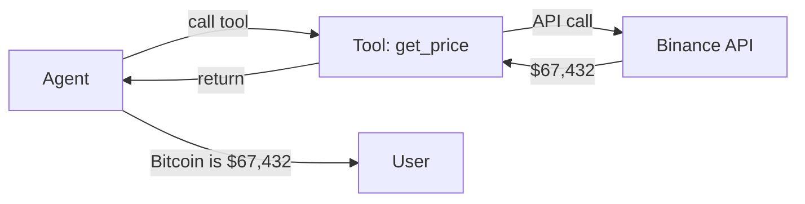

# Tools

Tools are **callable capabilities** that let agents interact with the outside world—APIs, databases, blockchains, file systems, and any other external service. Without tools, an LLM can only generate text. With tools, it can take action.

## Why Tools?

An LLM doesn't know today's Bitcoin price, can't send emails, and has no way to query your database. Tools bridge this gap:



SpoonOS tools are:

- **Typed** — JSON-schema parameters prevent LLM hallucination of invalid inputs
- **Validated** — Runtime checks ensure data integrity before execution
- **Async** — Non-blocking I/O for high-performance agent loops
- **Composable** — Bundle tools into toolkits, share via MCP protocol

## Tool Anatomy

Every SpoonOS tool has three parts:

| Part | Purpose | Example |
|------|---------|---------|
| **name** | Unique identifier the LLM uses to call the tool | `"get_crypto_price"` |
| **description** | Natural language explanation of what the tool does | `"Get real-time price for a cryptocurrency"` |
| **parameters** | JSON-schema defining expected inputs | `{"symbol": {"type": "string"}}` |

The LLM reads the description to decide *when* to use a tool and the parameters to know *how* to call it.

## What Can You Build?

| Tool Type | Examples |
|-----------|----------|
| **Data retrieval** | Web search, database queries, API calls |
| **Crypto/Web3** | CEX trading, DEX swaps, on-chain reads, wallet operations |
| **File operations** | Read/write files, parse documents, generate reports |
| **Communication** | Send emails, post to Slack, create tickets |
| **Computation** | Run code, execute SQL, perform calculations |

## SpoonOS vs Other Tool Systems

| Feature | SpoonOS | LangChain | OpenAI Functions |
|---------|---------|-----------|------------------|
| **Definition** | `BaseTool` class | `@tool` decorator | JSON in API call |
| **Validation** | JSON-schema + runtime | Optional Pydantic | Server-side only |
| **Remote tools** | MCP protocol (stdio/SSE/WS) | API wrappers | N/A |
| **Discovery** | `ToolManager` + semantic search | `load_tools()` | Manual |
| **Crypto native** | Built-in CEX/DEX/on-chain | Third-party | N/A |

---

## Quick Start

```bash
pip install spoon-ai-sdk
```

```python
import asyncio
from spoon_ai.tools.base import BaseTool
from spoon_ai.tools import ToolManager

# Define a tool with JSON-schema parameters
class GreetTool(BaseTool):
    name: str = "greet"
    description: str = "Greet someone by name"
    parameters: dict = {
        "type": "object",
        "properties": {"name": {"type": "string"}},
        "required": ["name"]
    }

    async def execute(self, name: str) -> str:
        return f"Hello, {name}!"

# Register and execute
manager = ToolManager([GreetTool()])

async def main():
    result = await manager.execute(name="greet", tool_input={"name": "World"})
    print(result)  # Hello, World!

asyncio.run(main())
```

---

## Tool Types

### Local Tools (`BaseTool`)

All tools inherit from `BaseTool` with three required attributes and one method:

```python
from spoon_ai.tools.base import BaseTool

class MyTool(BaseTool):
    name: str = "my_tool"                    # Unique identifier
    description: str = "What this tool does" # LLM reads this to decide when to use it
    parameters: dict = {                      # JSON-schema for input validation
        "type": "object",
        "properties": {
            "arg1": {"type": "string", "description": "First argument"},
            "arg2": {"type": "integer", "default": 10}
        },
        "required": ["arg1"]
    }

    async def execute(self, arg1: str, arg2: int = 10) -> str:
        return f"Result: {arg1}, {arg2}"
```

The `__call__` method forwards to `execute()`, so `await tool(arg1="value")` works.

### ToolManager

Orchestrates tool registration, lookup, and execution:

```python
from spoon_ai.tools import ToolManager

manager = ToolManager([MyTool(), AnotherTool()])

# Execute by name
result = await manager.execute(name="my_tool", tool_input={"arg1": "hello"})

# Get tool specs for LLM function calling
specs = manager.to_params()  # List of OpenAI-compatible tool definitions
```

**Key methods:**

- `add_tool(tool)` / `add_tools([...])` — Register tools
- `remove_tool(name)` — Unregister by name
- `get_tool(name)` — Retrieve tool instance
- `to_params()` — Export OpenAI-compatible tool definitions
- `index_tools()` / `query_tools(query)` — Semantic search (requires Pinecone + OpenAI)

### Crypto toolkit (optional)

If you install `spoon-toolkits`, import the concrete tools you need:

```python
from spoon_toolkits import CryptoPowerDataPriceTool, CryptoPowerDataCEXTool
from spoon_ai.tools import ToolManager

crypto_tools = [
    CryptoPowerDataPriceTool(),
    CryptoPowerDataCEXTool(),
]
manager = ToolManager(crypto_tools)
```

Environment variables for these tools depend on the specific provider (e.g., `OKX_API_KEY`, `BITQUERY_API_KEY`, `RPC_URL`, etc.).

### MCP client tools (`MCPTool`)

`MCPTool` lets an agent call tools hosted on an MCP server.

```python
from spoon_ai.tools.mcp_tool import MCPTool

mcp_tool = MCPTool(
    mcp_config={
        "url": "http://localhost:8765",      # or ws://..., or command/args for stdio
        "transport": "sse",                  # optional: "sse" (default) | "http"
        "timeout": 30,
        "max_retries": 3,
    }
)
# The tool’s schema/description is fetched dynamically from the MCP server.
```

`MCPTool.execute(...)` will fetch the server’s tool list, align the name/parameters, and perform retries and health checks.

### MCP clients

SpoonOS agents primarily use `MCPTool` (MCP client) to talk to remote MCP servers:

```python
from spoon_ai.tools.mcp_tool import MCPTool

# Example: connect to DeepWiki SSE MCP server
deepwiki = MCPTool(
    name="read_wiki_structure",  # Use the actual tool name from the server
    description="DeepWiki MCP tool for repository analysis",
    mcp_config={
        "url": "https://mcp.deepwiki.com/sse",
        "transport": "sse",
        "timeout": 30,
    },
)

async def main():
    # Pre-load parameters to get the correct schema
    print("Loading MCP tool parameters...")
    await deepwiki.ensure_parameters_loaded()
    
    # Use the correct parameter name: repoName (not repo)
    result = await deepwiki.execute(repoName="XSpoonAi/spoon-core")
    print(f"\nResult:\n{result}")

asyncio.run(main())
```

If you need to self-host an MCP server, follow that server’s own documentation; the cookbook focuses on the `spoon_ai` MCP client (`MCPTool`) rather than FastMCP server setup.

## Configuration

- **Core**: none required for basic tools.
- **Embedding index (optional)**: `OPENAI_API_KEY`, `PINECONE_API_KEY`.
- **Crypto/toolkit tools**: provider-specific keys (e.g., `OKX_API_KEY`, `BITQUERY_API_KEY`, `RPC_URL`, `GOPLUSLABS_API_KEY`).
- **MCP**: set transport target via `mcp_config` (`url` or `command` + `args`/`env`).

## Best Practices

- Keep tools single-purpose with clear `parameters` JSON schema.
- Validate inputs inside `execute`; raise rich errors for better agent feedback.
- Prefer async I/O in `execute` to avoid blocking the event loop.
- Reuse `ToolManager` for name-based dispatch and tool metadata generation.
- When using toolkit or MCP tools, fail gracefully if optional dependencies or servers are missing.

## See Also

- [API reference: Base Tool](../api-reference/spoon_ai/tools/base.md)
- [MCP protocol details](./mcp-protocol.md)
- [Custom tool guide](../how-to-guides/add-custom-tools.md)
