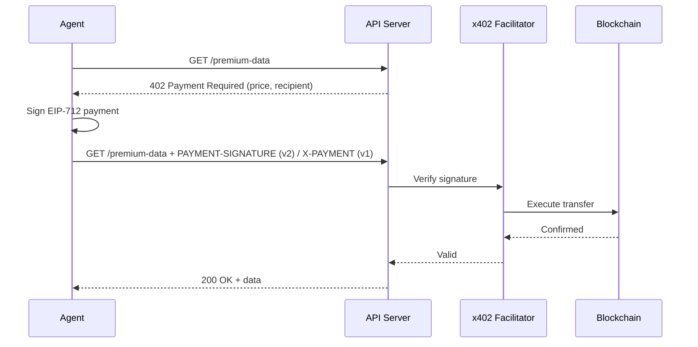
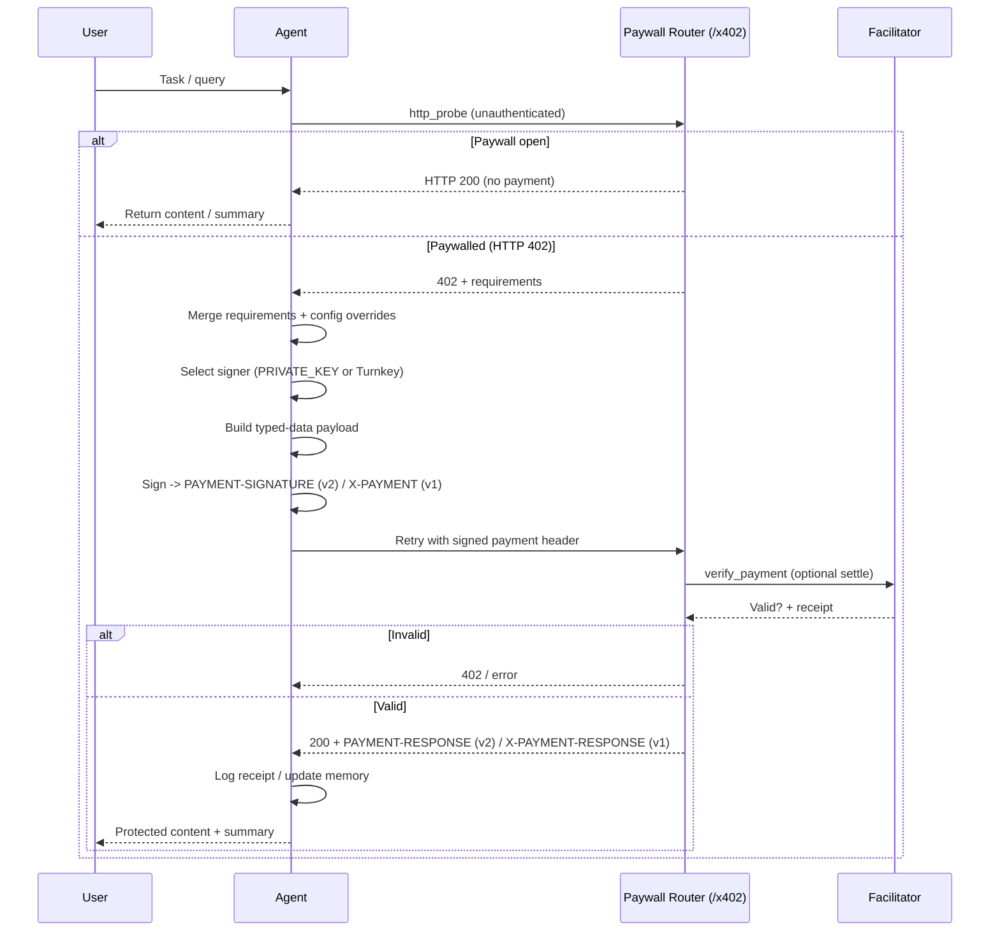

# x402 Payments

x402 enables **agents to pay for things autonomously**. When an agent hits a paywall (HTTP 402), it automatically signs a crypto payment, retries the request, and continues—no human intervention required. This creates a native monetization layer for AI services.

## Why x402?

Traditional payments don't work for autonomous agents:

| Problem | With Traditional Payments | With x402 |
|---------|---------------------------|-----------|
| Agent hits paywall | ❌ Wait for human to enter credit card | ✅ Auto-sign and retry |
| Micropayments ($0.001) | ❌ Fees exceed payment | ✅ Low-cost on L2s |
| Settlement | ❌ 1-3 days | ✅ Instant |
| Verification | ❌ Trust Stripe API | ✅ Cryptographic proof |

## How It Works



| Step | What Happens |
|------|--------------|
| **1. Request** | Agent calls a paid API endpoint |
| **2. 402 Response** | Server returns payment requirements (v2 via `PAYMENT-REQUIRED`, legacy v1 via JSON body) |
| **3. Sign** | Agent signs an EIP-712 typed-data payload (no gas yet) |
| **4. Retry** | Agent sends request again with the signed payment header (`PAYMENT-SIGNATURE` for v2, `X-PAYMENT` for v1) |
| **5. Verify & Execute** | Facilitator verifies signature and executes transfer on-chain |
| **6. Success** | Server returns the requested data |

## x402 vs Alternatives

| Aspect | x402 | Stripe | Lightning |
|--------|------|--------|-----------|
| **Settlement** | Instant | 1-3 days | Instant |
| **Agent autonomy** | Auto-sign | Needs webhook | Manual channel |
| **Micropayments** | ✅ L2 fees | ❌ High fees | ✅ |
| **Verification** | Cryptographic | API call | Node verification |

---

## Quick Start

```bash
pip install spoon-ai x402
export PRIVATE_KEY="your-wallet-private-key"
export X402_RECEIVER_ADDRESS="0xYourReceiverWallet"
```

```python
import asyncio
from spoon_ai.payments import X402PaymentService, X402PaymentRequest

# Initialize the payment service
service = X402PaymentService()

async def main():
    # Create a payment request
    request = X402PaymentRequest(
        amount_usdc="0.01",  # Amount in USDC
        resource="/premium-data",
        description="Access to premium data"
    )

    # Sign and create payment receipt
    receipt = await service.sign_and_pay(request)
    print(f"Payment signed: {receipt}")

asyncio.run(main())
```

> **Note:** For agent-based x402 payments, the agent handles 402 responses automatically when configured with payment capabilities. See the full examples in the x402 package for complete integration patterns.

---

## Components

| Piece | Role inside SpoonOS |
| --- | --- |
| **x402 facilitator** | Public service (`https://x402.org/facilitator` by default) that verifies and settles signed payment payloads. |
| **Paywall server** | Your FastAPI router (`spoon_ai.payments.app`) that refuses unpaid requests with a 402 payload and forwards valid calls to agents. |
| **SpoonReact agent** | Issues HTTP probes, signs payments via tools, and stores payment receipts in memory. |
| **Signer** | Either the `PRIVATE_KEY` loaded in-process or a Turnkey identity configured via `TURNKEY_*` variables. |

## Configuration surfaces

Most deployments only need a `.env` entry and (optionally) config overrides:

```bash
X402_RECEIVER_ADDRESS=0xwallet-that-receives-fees
X402_FACILITATOR_URL=https://x402.org/facilitator
X402_DEFAULT_ASSET=
X402_DEFAULT_NETWORK=
X402_DEFAULT_SCHEME=exact
X402_DEFAULT_AMOUNT_USDC=
X402_PAYWALL_APP_NAME=SpoonOS Agent Services
X402_PAYWALL_APP_LOGO=https://your-domain.example/logo.png
X402_DEMO_URL=https://www.x402.org/protected
```

Key points:

- The system always prefers the local `PRIVATE_KEY`. If that variable is empty and Turnkey credentials (`TURNKEY_*`) exist, SpoonOS transparently switches to hosted signing.
- In CLI workflows (spoon-cli or the legacy `main.py` CLI), the `x402` block in the CLI `config.json` mirrors these defaults (branding, description, timeout, etc.). Update that file when you need per-environment variance. The core SDK still reads values from environment variables.
- Setting `X402_DEFAULT_ASSET` ensures all typed-data domains reference the real USDC contract so signatures pass facilitator validation.

## Runtime lifecycle



If the paid retry fails (for example `verify_payment` rejects the header or the facilitator reports an error), the paywall server immediately returns another `402` or error payload and the agent decides whether to run `x402_paywalled_request` again with corrected parameters. A successful verification moves straight into settlement and target agent execution, so there is no additional retry cycle once the payment header is accepted (`PAYMENT-SIGNATURE` in v2, `X-PAYMENT` in legacy v1).

## Operational checklist

1. Use [https://faucet.circle.com/](https://faucet.circle.com/) to mint 0.01 USDC for the public demo.
2. Keep `X402_RECEIVER_ADDRESS` aligned with the wallet that ultimately receives settlements.
3. Monitor facilitator responses. Any `invalid_exact_evm_payload_signature` errors typically mean the `asset`, `chainId`, or nonce encoding no longer matches the paywall challenge.
4. Use `X402PaymentService.decode_payment_response(header)` to archive payment receipts in logs or analytics pipelines.
