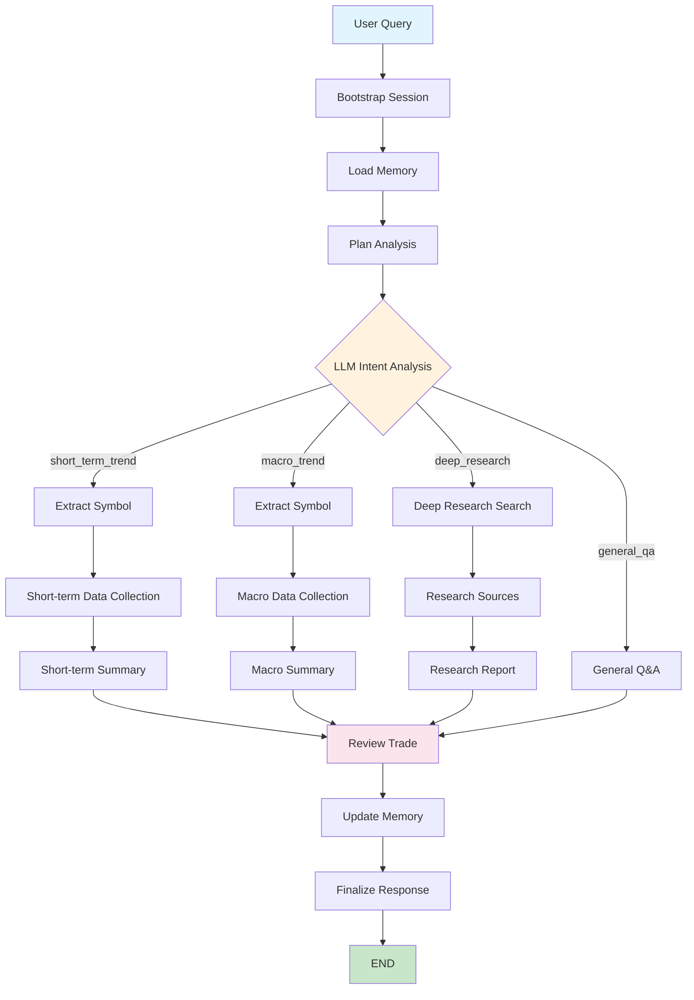

# Intent Graph Demo

This example demonstrates an intelligent StateGraph workflow with advanced query routing, parallel execution, and memory management using the modern declarative graph building system.

#### 📊 **Workflow Diagram**



#### 🎯 **Core Features**

**Intelligent Query Routing:**
- LLM-powered intent classification into: `general_qa`, `short_term_trend`, `macro_trend`, or `deep_research`
- Dynamic routing based on detected intent and conversation history
- Context-aware decision making with market context

**Parallel Data Processing:**
- Concurrent data fetching across multiple timeframes (15m, 30m, 1h, 4h, daily, weekly)
- Real-time cryptocurrency data integration
- Performance optimization through parallel execution

**Advanced Memory Management:**
- Persistent conversation context across sessions
- Automatic storage of learned patterns and market insights
- State preservation for analysis results and routing decisions

#### 🚀 **Key Capabilities**

- **Declarative Graph Building** - `GraphTemplate`, `NodeSpec`, `EdgeSpec` for modular workflows
- **High-Level API Integration** - `HighLevelGraphAPI` for automatic parameter inference
- **LLM Integration** - Advanced prompt engineering and response processing
- **Tool Orchestration** - Multi-source data integration (PowerData, Tavily, EVM swap)
- **Error Handling** - Robust recovery with duplicate log prevention
- **Performance Monitoring** - Built-in metrics and execution tracking

#### 📋 **Prerequisites**

```bash
# Required environment variables
export OPENAI_API_KEY="your-openai-api-key"
export TAVILY_API_KEY="your-tavily-api-key"       # Search engine
```

#### 🏃 **Quick Start**

```bash
# Navigate to examples directory
cd spoon-core/example

# Install dependencies
pip install -r requirements.txt

# Run the declarative intent graph demo
python intent_graph_demo.py
```

#### 🔍 **What to Observe**

**Architecture:**
- How `GraphTemplate` and `NodeSpec` simplify workflow construction
- `HighLevelGraphAPI` automatically inferring parameters from queries
- Modular node implementations with better separation of concerns

**Execution Flow:**
- Intelligent routing to appropriate analysis paths based on query intent
- Parallel data fetching across multiple timeframes
- Memory loading and updates throughout the process

**Performance:**
- Execution times for different routing paths
- Parallel vs sequential processing performance
- Memory usage optimization and duplicate log prevention

**Advanced Behaviors:**
- LLM-powered routing decisions based on intent analysis
- Real-time data integration from multiple sources
- Context maintenance across complex workflows

#### 📁 **Source Code**

- **Main Example**: [intent_graph_demo.py](https://github.com/XSpoonAi/spoon-core/blob/main/examples/intent_graph_demo.py)
- **Supporting Modules**:
  - `spoon_ai/graph/` - Core graph system and declarative builders
  - `spoon_ai/graph/builder.py` - High-level API and parameter inference
  - [Graph System Docs](../graph-system/index.md)

#### 🎓 **Learning Outcomes**

- Using declarative graph building (`GraphTemplate`, `NodeSpec`, `EdgeSpec`)
- Leveraging `HighLevelGraphAPI` for automatic parameter inference
- Implementing modular, maintainable node functions
- Advanced LLM integration and prompt engineering
- Parallel processing for performance optimization
- Memory management in long-running processes
- Error handling and recovery strategies

#### 💡 **Best Practices**

- Declarative architecture for improved modularity
- High-level API usage for automatic parameter inference
- Scalable design for easy extension
- Resource-efficient implementation
- Maintainable, well-documented code

