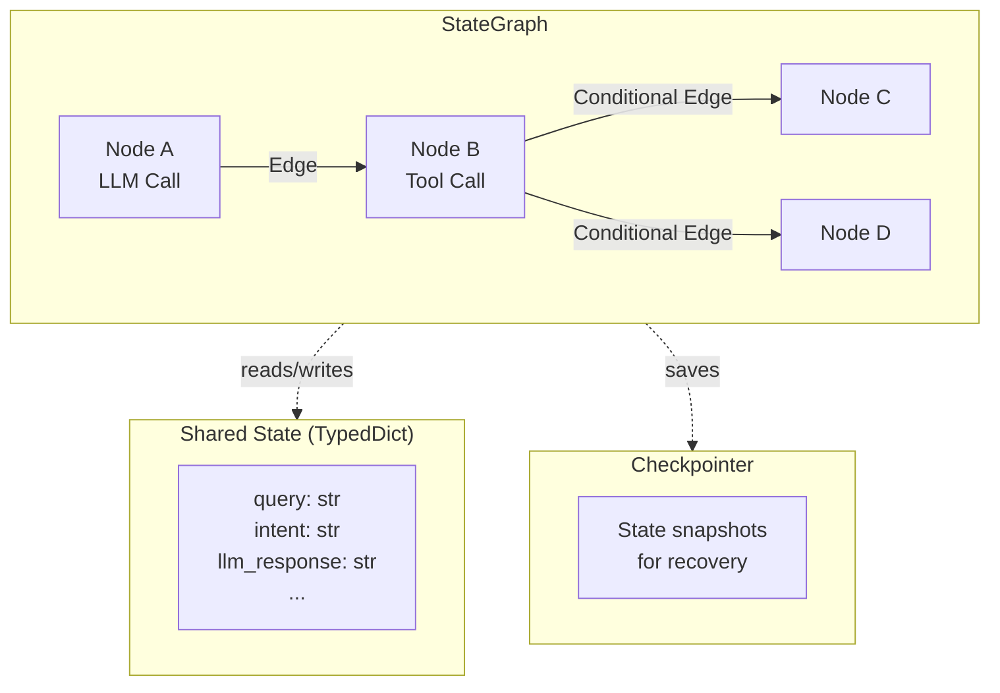
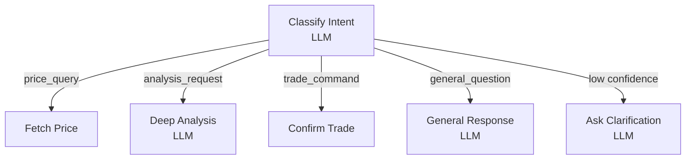

# Core Concepts

This guide covers the fundamental building blocks of the SpoonOS Graph System. Master these concepts and you'll be able to build any LLM-powered workflow.

**You will learn:** State, nodes, edges, checkpointing, and merge behavior
**Best for:** Beginners who finished Quick Start
**Time to complete:** ~5–8 minutes

## Overview



| Concept | Description | Key Point |
|---------|-------------|-----------|
| **State** | Typed dictionary shared across all nodes | Each node reads state, returns updates |
| **Node** | Async function (often calling LLM) | Single responsibility, returns partial update |
| **Edge** | Connection between nodes | Static, conditional, or LLM-driven |
| **Checkpoint** | State snapshot before each node | Enables recovery and human-in-the-loop |

---

## State

**State** is a `TypedDict` that flows through your entire graph. Every node receives the current state and can return updates to merge back.

### Defining State for LLM Workflows

```python
from typing import TypedDict, List, Dict, Any, Optional

class ConversationState(TypedDict):
    # Input fields
    user_query: str
    user_id: str

    # LLM-related fields
    messages: List[dict]           # Chat history for context
    intent: str                    # Classified intent
    extracted_params: Dict[str, Any]  # Parameters extracted by LLM

    # Processing fields
    llm_analysis: str              # LLM's analysis output
    tool_results: Dict[str, Any]   # Results from tool calls

    # Output fields
    final_response: str            # Final response to user
    confidence: float              # LLM's confidence score

    # System fields
    execution_log: List[str]
```

### State Merge Behavior

When a node returns an update, SpoonOS **merges** it into the existing state:

| Field Type | Merge Strategy | Example |
|------------|----------------|---------|
| **Scalar** (str, int, float, bool) | Replace | `"old" → "new"` |
| **dict** | Deep merge | `{a: 1} + {b: 2} → {a: 1, b: 2}` |
| **list** | Append (capped at 100) | `[1, 2] + [3] → [1, 2, 3]` |
| **None** | No change | Field keeps previous value |

```python
import asyncio
import os
from typing import Any, Dict, TypedDict

from spoon_ai.llm import LLMManager
from spoon_ai.schema import Message


class ConversationState(TypedDict, total=False):
    user_query: str
    intent: str
    extracted_params: Dict[str, Any]
    confidence: float


llm = LLMManager()


async def analyze_with_llm(state: ConversationState) -> dict:
    """Example: LLM node returns a partial update."""
    if os.getenv("DOC_SNIPPET_MODE") == "1":
        return {
            "intent": "price_query",
            "extracted_params": {"symbol": "BTC"},
            "confidence": 0.92,
        }

    await llm.chat(
        [
            Message(role="system", content="Analyze user intent and extract parameters."),
            Message(role="user", content=state["user_query"]),
        ],
        max_tokens=80,
    )

    # Only return fields that changed
    return {
        "intent": "price_query",
        "extracted_params": {"symbol": "BTC"},
        "confidence": 0.92,
    }


async def main() -> None:
    print(await analyze_with_llm({"user_query": "BTC price?"}))


if __name__ == "__main__":
    asyncio.run(main())
```

### State Best Practices

:::tip Guidelines
1. **Use TypedDict** - Get IDE autocomplete and type checking
2. **Include messages field** - For multi-turn LLM conversations
3. **Track confidence** - LLM outputs should include confidence scores
4. **Keep it JSON-serializable** - Required for checkpointing
5. **Initialize all fields** - Provide defaults at invoke time
:::

---

## Nodes

**Nodes** are async functions that perform work—typically calling an LLM, executing tools, or processing data.

### Node Contract

```python
import asyncio
import os
from typing import Any, Dict, List, TypedDict

from spoon_ai.llm import LLMManager
from spoon_ai.schema import Message


class MyState(TypedDict, total=False):
    user_query: str
    messages: List[Dict[str, Any]]
    llm_response: str


llm = LLMManager()


async def my_llm_node(state: MyState) -> dict:
    """
    Node function signature:

    Args:
        state: Current graph state (read-only view)

    Returns:
        dict: Fields to update (merged into state)
    """
    # Read from state
    query = state.get("user_query", "")
    messages = state.get("messages", [])  # List of dicts for serialization

    if os.getenv("DOC_SNIPPET_MODE") == "1":
        response_text = f"(stub) response for: {query}"
    else:
        # Convert history to Message objects and call LLM
        history = [Message(role=m["role"], content=m["content"]) for m in messages]
        response = await llm.chat(history + [Message(role="user", content=query)], max_tokens=120)
        response_text = response.content

    # Return updates (partial, not full state)
    # Store messages as dicts for JSON serialization
    return {
        "llm_response": response_text,
        "messages": messages + [
            {"role": "user", "content": query},
            {"role": "assistant", "content": response_text}
        ]
    }


async def main() -> None:
    result = await my_llm_node({"user_query": "hello", "messages": []})
    print(result["llm_response"])


if __name__ == "__main__":
    asyncio.run(main())
```

### Node Patterns for LLM

#### Pattern 1: Intent Classification

```python
import asyncio
import os
from typing import Any, Dict, List, TypedDict

from spoon_ai.llm import LLMManager
from spoon_ai.schema import Message


class ConversationState(TypedDict, total=False):
    user_query: str
    intent: str
    confidence: float
    messages: List[Dict[str, Any]]


llm = LLMManager()


async def classify_intent_node(state: ConversationState) -> dict:
    """Use LLM to classify user intent."""
    if os.getenv("DOC_SNIPPET_MODE") == "1":
        return {"intent": "general_question", "confidence": 0.9}

    response = await llm.chat(
        [
            Message(
                role="system",
                content=(
                    'Respond with JSON only: {"intent": "price_query|analysis_request|trade_command|general_question", '
                    '"confidence": 0.0-1.0}'
                ),
            ),
            Message(role="user", content=state["user_query"]),
        ],
        max_tokens=80,
    )

    import json

    result = json.loads(response.content)
    return {"intent": result["intent"], "confidence": result["confidence"]}


async def main() -> None:
    print(await classify_intent_node({"user_query": "What is BTC price?"}))


if __name__ == "__main__":
    asyncio.run(main())
```

#### Pattern 2: Parameter Extraction

```python
import asyncio
import os
from typing import Any, Dict, TypedDict

from spoon_ai.llm import LLMManager
from spoon_ai.schema import Message


class ConversationState(TypedDict, total=False):
    user_query: str
    extracted_params: Dict[str, Any]


llm = LLMManager()


async def extract_params_node(state: ConversationState) -> dict:
    """Use LLM to extract parameters from natural language."""
    if os.getenv("DOC_SNIPPET_MODE") == "1":
        return {"extracted_params": {"symbol": "BTC", "action": "buy", "amount": 0.1, "price_type": "market"}}

    response = await llm.chat(
        [
            Message(
                role="system",
                content=(
                    'Extract trading parameters as JSON only. Example: '
                    '{"symbol": "BTC", "action": "buy", "amount": 0.1, "price_type": "market"}'
                ),
            ),
            Message(role="user", content=state["user_query"]),
        ],
        max_tokens=120,
    )

    import json

    params = json.loads(response.content)
    return {"extracted_params": params}


async def main() -> None:
    print(await extract_params_node({"user_query": "Buy 0.1 BTC at market"}))


if __name__ == "__main__":
    asyncio.run(main())
```

#### Pattern 3: Analysis with Context

```python
import asyncio
import os
from typing import Any, Dict, List, TypedDict

from spoon_ai.llm import LLMManager
from spoon_ai.schema import Message


class ConversationState(TypedDict, total=False):
    user_query: str
    intent: str
    tool_results: Dict[str, Any]
    messages: List[Dict[str, Any]]
    llm_analysis: str


llm = LLMManager()


async def analyze_with_context_node(state: ConversationState) -> dict:
    """LLM analysis using accumulated context."""
    context = f"""
User Query: {state.get('user_query')}
Intent: {state.get('intent')}
Market Data: {state.get('tool_results', {}).get('market_data', 'N/A')}
Recent Messages: {state.get('messages', [])[-3:]}
"""

    if os.getenv("DOC_SNIPPET_MODE") == "1":
        return {"llm_analysis": f"(stub) analysis for: {state.get('user_query', '')}"}

    response = await llm.chat(
        [
            Message(role="system", content="You are an expert crypto analyst. Provide detailed analysis."),
            Message(role="user", content=context),
        ],
        max_tokens=200,
    )

    return {"llm_analysis": response.content}


async def main() -> None:
    result = await analyze_with_context_node(
        {"user_query": "Analyze BTC", "intent": "analysis_request", "tool_results": {}, "messages": []}
    )
    print(result["llm_analysis"])


if __name__ == "__main__":
    asyncio.run(main())
```

#### Pattern 4: Response Generation

```python
import asyncio
import os
from typing import Any, Dict, List, TypedDict

from spoon_ai.llm import LLMManager
from spoon_ai.schema import Message


class ConversationState(TypedDict, total=False):
    user_query: str
    llm_analysis: str
    tool_results: Dict[str, Any]
    messages: List[Dict[str, Any]]
    final_response: str


llm = LLMManager()


async def generate_response_node(state: ConversationState) -> dict:
    """Generate final user-facing response."""
    if os.getenv("DOC_SNIPPET_MODE") == "1":
        response_text = f"(stub) response for: {state.get('user_query', '')}"
    else:
        response = await llm.chat(
            [
                Message(
                    role="system",
                    content="Generate a helpful, concise response. Be clear and actionable.",
                ),
                Message(
                    role="user",
                    content=(
                        f"Original Query: {state.get('user_query')}\n"
                        f"Analysis: {state.get('llm_analysis')}\n"
                        f"Data: {state.get('tool_results', {})}\n"
                    ),
                ),
            ],
            max_tokens=200,
        )
        response_text = response.content

    return {
        "final_response": response_text,
        "messages": state.get("messages", []) + [{"role": "assistant", "content": response_text}],
    }


async def main() -> None:
    result = await generate_response_node(
        {"user_query": "hello", "llm_analysis": "", "tool_results": {}, "messages": []}
    )
    print(result["final_response"])


if __name__ == "__main__":
    asyncio.run(main())
```

---

## Edges

**Edges** define how control flows between nodes. The Graph System supports multiple edge types.

### 1. Static Edges

Always transition from source to target:

```python
import asyncio
from typing import Any, Dict, List, TypedDict

from spoon_ai.graph import StateGraph, END


class ConversationState(TypedDict, total=False):
    user_query: str
    intent: str
    llm_analysis: str
    final_response: str
    messages: List[Dict[str, Any]]


async def classify_intent_node(state: ConversationState) -> dict:
    return {"intent": "general_question"}


async def analyze_with_context_node(state: ConversationState) -> dict:
    return {"llm_analysis": f"(stub) analysis of: {state.get('user_query', '')}"}


async def generate_response_node(state: ConversationState) -> dict:
    return {"final_response": f"(stub) response: {state.get('llm_analysis', '')}"}


graph = StateGraph(ConversationState)
graph.add_node("classify", classify_intent_node)
graph.add_node("analyze", analyze_with_context_node)
graph.add_node("respond", generate_response_node)

graph.set_entry_point("classify")
graph.add_edge("classify", "analyze")
graph.add_edge("analyze", "respond")
graph.add_edge("respond", END)

app = graph.compile()


async def main() -> None:
    result = await app.invoke({"user_query": "Explain Bitcoin"})
    print(result["final_response"])


if __name__ == "__main__":
    asyncio.run(main())
```

### 2. Conditional Edges (LLM-Driven Routing)

Route based on LLM classification:

```python
import asyncio
from typing import TypedDict

from spoon_ai.graph import StateGraph, END


class ConversationState(TypedDict, total=False):
    user_query: str
    intent: str
    confidence: float
    output: str


def route_by_intent(state: ConversationState) -> str:
    """Route based on LLM-classified intent."""
    intent = state.get("intent", "general")
    confidence = state.get("confidence", 0)

    # Low confidence → ask for clarification
    if confidence < 0.7:
        return "clarify"

    return intent


async def classify(state: ConversationState) -> dict:
    q = (state.get("user_query") or "").lower()
    if "price" in q:
        return {"intent": "price_query", "confidence": 0.95}
    if "analy" in q:
        return {"intent": "analysis_request", "confidence": 0.9}
    if "buy" in q or "sell" in q:
        return {"intent": "trade_command", "confidence": 0.9}
    return {"intent": "general_question", "confidence": 0.9}


async def fetch_price(state: ConversationState) -> dict:
    return {"output": "price handler"}


async def deep_analysis(state: ConversationState) -> dict:
    return {"output": "analysis handler"}


async def confirm_trade(state: ConversationState) -> dict:
    return {"output": "trade confirmation handler"}


async def general_response(state: ConversationState) -> dict:
    return {"output": "general handler"}


async def ask_clarification(state: ConversationState) -> dict:
    return {"output": "clarification handler"}


graph = StateGraph(ConversationState)
graph.add_node("classify", classify)
graph.add_node("fetch_price", fetch_price)
graph.add_node("deep_analysis", deep_analysis)
graph.add_node("confirm_trade", confirm_trade)
graph.add_node("general_response", general_response)
graph.add_node("ask_clarification", ask_clarification)
graph.set_entry_point("classify")

graph.add_conditional_edges(
    "classify",
    route_by_intent,
    {
        "price_query": "fetch_price",
        "analysis_request": "deep_analysis",
        "trade_command": "confirm_trade",
        "general_question": "general_response",
        "clarify": "ask_clarification",
    },
)

for node in ["fetch_price", "deep_analysis", "confirm_trade", "general_response", "ask_clarification"]:
    graph.add_edge(node, END)

app = graph.compile()


async def main() -> None:
    result = await app.invoke({"user_query": "price of BTC?"})
    print(result["output"])


if __name__ == "__main__":
    asyncio.run(main())
```



### 3. LLM-Powered Routing (Dynamic)

Let the LLM itself decide the next step. The simplest way is to enable the built-in LLM router and let it select the next node name.

```python
import asyncio
from typing import TypedDict

from spoon_ai.graph import StateGraph, END
from spoon_ai.graph.config import GraphConfig, RouterConfig


class ConversationState(TypedDict, total=False):
    user_query: str
    result: str


async def route(state: ConversationState) -> dict:
    # No-op entry node. LLM routing runs after this node.
    return state


async def web_search(state: ConversationState) -> dict:
    return {"result": f"(stub) web search: {state['user_query']}"}


async def respond(state: ConversationState) -> dict:
    return {"result": f"(stub) response: {state['user_query']}"}


graph = StateGraph(ConversationState)
graph.add_node("route", route)
graph.add_node("web_search", web_search)
graph.add_node("respond", respond)
graph.set_entry_point("route")

# Once a handler runs, end the graph.
graph.add_edge("web_search", END)
graph.add_edge("respond", END)

# Enable LLM routing and restrict targets.
graph.config = GraphConfig(
    router=RouterConfig(
        allow_llm=True,
        allowed_targets=["web_search", "respond"],
        default_target="respond",
    )
)
graph.enable_llm_routing(config={"model": "gpt-4", "temperature": 0.1, "max_tokens": 50})

app = graph.compile()


async def main():
    result = await app.invoke({"user_query": "Any BTC news today?", "result": ""})
    print(result["result"])


if __name__ == "__main__":
    asyncio.run(main())
```

### Complete LLM Routing Example

```python
import asyncio
from typing import TypedDict
from spoon_ai.graph import StateGraph, END
from spoon_ai.llm import LLMManager
from spoon_ai.schema import Message

class RouterState(TypedDict):
    query: str
    intent: str
    confidence: float
    result: str

llm = LLMManager()

async def classify_intent(state: RouterState) -> dict:
    """LLM classifies intent with confidence."""
    response = await llm.chat([
        Message(role="system", content="""Classify and respond with JSON:
        {"intent": "price|news|analysis|general", "confidence": 0.0-1.0}"""),
        Message(role="user", content=state["query"])
    ])

    import json
    result = json.loads(response.content)
    return {"intent": result["intent"], "confidence": result["confidence"]}

async def handle_price(state: RouterState) -> dict:
    response = await llm.chat([
        Message(role="system", content="Provide cryptocurrency price information."),
        Message(role="user", content=state["query"])
    ])
    return {"result": response.content}

async def handle_news(state: RouterState) -> dict:
    response = await llm.chat([
        Message(role="system", content="Summarize relevant crypto news."),
        Message(role="user", content=state["query"])
    ])
    return {"result": response.content}

async def handle_analysis(state: RouterState) -> dict:
    response = await llm.chat([
        Message(role="system", content="Provide detailed market analysis."),
        Message(role="user", content=state["query"])
    ])
    return {"result": response.content}

async def handle_general(state: RouterState) -> dict:
    response = await llm.chat([
        Message(role="system", content="You are a helpful crypto assistant."),
        Message(role="user", content=state["query"])
    ])
    return {"result": response.content}

def route_by_intent(state: RouterState) -> str:
    return state.get("intent", "general")

# Build graph
graph = StateGraph(RouterState)

graph.add_node("classify", classify_intent)
graph.add_node("price_handler", handle_price)
graph.add_node("news_handler", handle_news)
graph.add_node("analysis_handler", handle_analysis)
graph.add_node("general_handler", handle_general)

graph.set_entry_point("classify")

graph.add_conditional_edges(
    "classify",
    route_by_intent,
    {
        "price": "price_handler",
        "news": "news_handler",
        "analysis": "analysis_handler",
        "general": "general_handler"
    }
)

graph.add_edge("price_handler", END)
graph.add_edge("news_handler", END)
graph.add_edge("analysis_handler", END)
graph.add_edge("general_handler", END)

app = graph.compile()


async def main():
    result = await app.invoke(
        {"query": "What is the current price of Bitcoin?", "intent": "", "confidence": 0.0, "result": ""}
    )
    print(result["result"])


if __name__ == "__main__":
    asyncio.run(main())
```

---

## Checkpointing

**Checkpointing** automatically saves state snapshots before each node execution. This enables:

- **Recovery**: Resume from last successful node after failure
- **Multi-turn conversations**: Maintain LLM context across sessions
- **Human-in-the-loop**: Pause for user input, resume with new data

### Configuring Checkpointing

```python
from typing import Any, Dict, List, TypedDict

from spoon_ai.graph import StateGraph, InMemoryCheckpointer

checkpointer = InMemoryCheckpointer(
    max_checkpoints_per_thread=100
)

class ConversationState(TypedDict, total=False):
    user_query: str
    messages: List[Dict[str, Any]]
    llm_analysis: str

graph = StateGraph(
    ConversationState,
    checkpointer=checkpointer
)
print("checkpointer configured:", graph.checkpointer is checkpointer)
```

### Multi-Turn LLM Conversations

```python
import asyncio

from typing import Any, Dict, List, TypedDict

from spoon_ai.graph import StateGraph, END, InMemoryCheckpointer


class ConversationState(TypedDict, total=False):
    user_query: str
    messages: List[Dict[str, Any]]
    llm_response: str


checkpointer = InMemoryCheckpointer(max_checkpoints_per_thread=100)


async def respond(state: ConversationState) -> dict:
    # Minimal, deterministic "LLM" for docs.
    user_query = state.get("user_query", "")
    response_text = f"(stub) answer to: {user_query}"
    messages = state.get("messages", [])
    return {
        "llm_response": response_text,
        "messages": messages
        + [{"role": "user", "content": user_query}, {"role": "assistant", "content": response_text}],
    }


graph = StateGraph(ConversationState, checkpointer=checkpointer)
graph.add_node("respond", respond)
graph.set_entry_point("respond")
graph.add_edge("respond", END)
app = graph.compile()


async def main() -> None:
    # First turn
    result = await app.invoke(
        {"user_query": "What is Bitcoin?", "messages": []},
        config={"configurable": {"thread_id": "user_123_session"}},
    )

    # Second turn - LLM has context from first turn
    result = await app.invoke(
        {"user_query": "What about its price trend?", "messages": result["messages"]},
        config={"configurable": {"thread_id": "user_123_session"}},
    )

    # The LLM knows "its" refers to Bitcoin from the conversation history
    print(result)


if __name__ == "__main__":
    asyncio.run(main())
```

### Recovery from Failure

```python
import asyncio
from typing import TypedDict

from spoon_ai.graph import StateGraph, END, InMemoryCheckpointer


class ConversationState(TypedDict, total=False):
    user_query: str
    llm_analysis: str
    should_fail: bool


checkpointer = InMemoryCheckpointer(max_checkpoints_per_thread=100)


async def maybe_fail(state: ConversationState) -> dict:
    if state.get("should_fail"):
        raise RuntimeError("simulated failure")
    return {"llm_analysis": f"(stub) analysis for: {state.get('user_query', '')}"}


graph = StateGraph(ConversationState, checkpointer=checkpointer)
graph.add_node("maybe_fail", maybe_fail)
graph.set_entry_point("maybe_fail")
graph.add_edge("maybe_fail", END)
app = graph.compile()


async def main() -> None:
    config = {"configurable": {"thread_id": "analysis_session"}}
    try:
        initial_state = {"user_query": "Analyze BTC", "llm_analysis": "", "should_fail": True}
        result = await app.invoke(initial_state, config=config)
        print(result)
    except Exception as e:
        print(f"Failed: {e}")

        # Get last successful state
        last_state = graph.get_state(config)

        if last_state:
            print(f"Last node: {last_state.metadata.get('node')}")
            print(f"Checkpoint values: {last_state.values}")


if __name__ == "__main__":
    asyncio.run(main())
```

---

## Key Takeaways

1. **State carries LLM context** - Messages, extracted params, analysis results flow through
2. **Nodes encapsulate LLM calls** - Each node does one LLM task well
3. **Edges route based on LLM output** - Intent classification drives workflow
4. **Checkpoints enable conversations** - Multi-turn context preserved across calls

## Next Steps

Learn how to construct graphs using different API styles:

**[Building Graphs →](./building-graphs.md)** - Imperative, Declarative, and High-Level APIs
