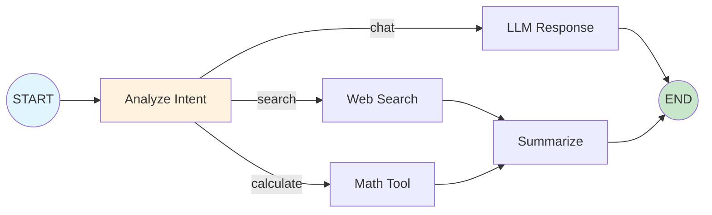
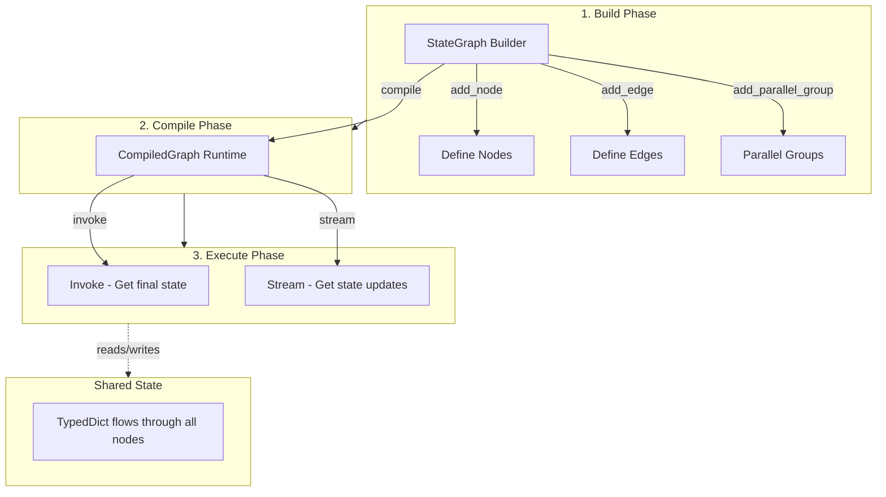

# Graph System

The SpoonOS Graph System is a powerful library for building **stateful, multi-step AI agent workflows**. It models applications as directed graphs where **nodes** represent actions (calling an LLM, executing a tool, processing data) and **edges** define how control flows between them—including conditional branching, parallel fan-out, and cycles for iterative reasoning.

## Start Here

- Just getting started? Go straight to **[Quick Start](./quick-start.md)** for a runnable example in under 2 minutes.
- Want to understand the building blocks? Read **[Core Concepts](./core-concepts.md)** after the quick start.
- Need API styles and patterns? See **[Building Graphs](./building-graphs.md)** and **[Examples](./examples.md)**.
- Looking for routing/parallel/HITL quick snippets? Jump to **[Advanced Features](./advanced-features.md)**
- Need setup? Follow **[Getting Started / Installation](../getting-started/installation.md)** before running examples.
- **You will learn:** How to build, run, and checkpoint simple graphs
- **Best for:** First-time users; time to complete: 2–5 minutes

### Common Pitfalls

- Checkpoint APIs (`get_state`, `get_state_history`) require a `thread_id` in `config.configurable`
- Use the exported constants (`from spoon_ai.graph import END`) instead of string literals
- When adding parallel groups, ensure all member nodes are registered before grouping
- Conditional routes must return existing node names (or `END`) to avoid configuration errors

## What is the Graph System?

Think of the Graph System as a workflow orchestration engine for AI agents. Instead of writing linear chains of prompts and responses, you define a graph where each node is a specific task, and edges determine the flow between tasks based on data, conditions, or even LLM decisions.

This simple graph shows how a single user query can be routed to different processing paths based on detected intent, with results flowing to appropriate next steps.

## Why Use Graphs for Agents?

Traditional LLM applications are often simple chains: prompt → response → done. But real-world AI agents need more sophisticated capabilities:

### Core Capabilities

| Capability | Description | Use Case |
|-----------|-------------|----------|
| **State Persistence** | Remember context across multiple steps and interactions | Multi-turn conversations, data accumulation |
| **Conditional Logic** | Take different paths based on LLM outputs or external data | Intent routing, quality checks |
| **Parallel Execution** | Run multiple tasks simultaneously and combine results | Multi-source data fetching, redundancy |
| **Human-in-the-Loop** | Pause for user input, approval, or correction | Trade confirmations, content review |
| **Error Recovery** | Handle failures gracefully without losing progress | Retry with backoff, circuit breakers |
| **Iterative Refinement** | Loop back to improve results based on validation | Quality improvement, self-correction |

### Real-World Scenarios

**Autonomous Research Agent**: Search → Grade relevance → Regenerate query if needed → Synthesize findings
- Without graphs: Hard-coded retry logic, tangled control flow
- With graphs: Clean conditional edges, checkpointed state for recovery

**Multi-Source Data Analysis**: Fetch from APIs A, B, C in parallel → Wait for quorum → Aggregate → Generate report
- Without graphs: Manual thread management, complex error handling
- With graphs: Built-in parallel execution with join strategies and timeouts

**Trading Assistant**: Analyze market → Generate recommendation → *Human approval* → Execute trade → Confirm
- Without graphs: Interrupt/resume logic scattered across codebase
- With graphs: First-class interrupt nodes with stateful resumption

## Graph System vs LangGraph

SpoonOS Graph System is inspired by [LangGraph](https://github.com/langchain-ai/langgraph) and shares similar concepts. Here's how they compare:

| Feature | SpoonOS Graph | LangGraph |
|---------|---------------|-----------|
| **Core Paradigm** | StateGraph with typed state dictionary | StateGraph with message passing |
| **Parallel Groups** | Native `add_parallel_group()` with quorum joins, timeouts, circuit breakers | Manual asyncio or branching |
| **Routing Stack** | Priority-based: explicit → rules → intelligent → LLM → fallback | Conditional edges only |
| **Declarative Definition** | `GraphTemplate` / `NodeSpec` / `EdgeSpec` for serializable, composable graphs | Imperative builder only |
| **Resource Control** | Built-in rate limiting, max concurrency, circuit breakers | External implementation |
| **Web3/Crypto** | Native integration with SpoonOS toolkits (CEX, DEX, on-chain) | Via third-party tools |
| **High-Level API** | Automatic parameter inference from LLM analysis | Manual parameter extraction |

**When to choose SpoonOS Graph**:
- ✅ Need production-grade parallel execution with sophisticated join strategies
- ✅ Require multi-layer routing (rules → intelligent → LLM fallback)
- ✅ Building crypto/DeFi/Web3 agents with native blockchain integration
- ✅ Want declarative graph templates for version control and team collaboration
- ✅ Need automatic parameter inference from natural language queries

**When to consider LangGraph**:
- LangChain ecosystem integration is primary requirement
- Simpler message-passing paradigm fits your use case
- Want to leverage LangSmith for tracing and debugging

## When to Use Graph vs ReAct Agents

| Decision Factor | Use Graph System | Use ReAct Agent |
|----------------|------------------|-----------------|
| **Workflow Complexity** | Multi-step, branching, or parallel workflows | Single-shot or simple tool-calling |
| **State Management** | Need to persist state across multiple steps | Stateless or simple context |
| **Control Flow** | Conditional routing, loops, human-in-the-loop | Linear execution with tool calls |
| **Scalability** | Multiple concurrent operations, resource limits | Simple, fast responses |
| **Error Handling** | Sophisticated retry, recovery, circuit breakers | Basic error messages |
| **Use Case Examples** | Research pipelines, trading systems, multi-agent collaboration | Q&A, simple task execution, one-shot analysis |

**Rule of Thumb**: If you need more than 3 sequential steps OR any kind of branching/parallel execution OR state that persists across interactions → use Graph System.

## What Can You Build?

### Autonomous Agents
Multi-step reasoning with tool calls, observation loops, and adaptive planning. Example: Research agent that searches → evaluates source quality → decides to search again or synthesize.

### RAG Pipelines
Retrieve → Grade → Regenerate cycles with conditional routing based on relevance scores. Example: Keep searching until you find high-quality sources or hit iteration limit.

### Multi-Agent Systems
Multiple specialized agents collaborating via shared state and handoffs. Example: Analyst agent → Risk agent → Execution agent with approval gates.

### Trading Workflows
Market analysis → Strategy generation → *Human approval* → Order execution → Monitoring. Example: Crypto trading assistant with human-in-the-loop for all trades.

### Parallel Analysis
Fan-out to multiple data sources, join results with configurable strategies. Example: Fetch price data from 5 exchanges, use quorum (3/5) for consensus.

## Architecture at a Glance

**Three phases**:
1. **Build**: Define your workflow topology (nodes, edges, routing)
2. **Compile**: Create executable runtime with optimizations
3. **Execute**: Run the workflow with `invoke()` or `stream()`

Throughout execution, a **shared state** (TypedDict) flows through the graph, with each node reading and updating relevant fields.

## Next Steps

Ready to build your first graph? Start with the **[Quick Start Guide](./quick-start.md)** to see a working example in under 2 minutes.

Or dive deeper into **[Core Concepts](./core-concepts.md)** to understand the building blocks: State, Nodes, Edges, and Checkpointing.

---

**Quick Links**:
- [Quick Start](./quick-start.md) - Build your first graph in 2 minutes
- [Core Concepts](./core-concepts.md) - Understand State, Nodes, Edges
- [Building Graphs](./building-graphs.md) - Learn the three API styles
- [Advanced Features](./advanced-features.md) - Routing, parallel execution, HITL
- [Integration](./integration.md) - Connect with tools, MCP, memory
- [Examples](./examples.md) - Practical patterns and use cases

**External Resources**:
- [LangGraph Documentation](https://langchain-ai.github.io/langgraph/)
- [LangGraph Tutorial](https://www.datacamp.com/tutorial/langgraph-tutorial)
- [Real Python LangGraph Guide](https://realpython.com/langgraph-python/)
