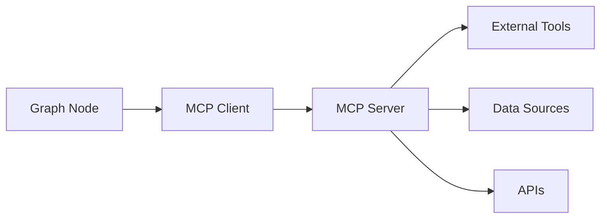

# Integration & Extensions

The Graph System integrates seamlessly with the broader SpoonOS ecosystem. This guide covers how to connect graphs with agents, tools, MCP servers, and memory systems.

## GraphAgent Integration

`GraphAgent` wraps graph execution with SpoonOS agent lifecycle, persistent memory, and session management.

### Basic GraphAgent Usage

```python
import asyncio
from typing import TypedDict

from spoon_ai.graph import END, StateGraph, GraphAgent


class AnalysisState(TypedDict, total=False):
    input: str
    output: str


async def analyze(state: AnalysisState) -> dict:
    return {"output": f"Analyzed: {state.get('input', '')}"}


def build_analysis_graph() -> StateGraph:
    graph = StateGraph(AnalysisState)
    graph.add_node("analyze", analyze)
    graph.set_entry_point("analyze")
    graph.add_edge("analyze", END)
    return graph  # IMPORTANT: uncompiled StateGraph


async def main():
    agent = GraphAgent(
        name="crypto_analyzer",
        graph=build_analysis_graph(),
        memory_path="./agent_memory",
        session_id="user_123_session",
        preserve_state=True,  # Preserve state between runs
    )

    result = await agent.run("Analyze BTC price trends")
    print(result)


if __name__ == "__main__":
    asyncio.run(main())
```

### Agent Configuration

```python
from typing import TypedDict

from spoon_ai.graph import END, StateGraph, GraphAgent


class AnalysisState(TypedDict, total=False):
    input: str
    output: str


async def analyze(state: AnalysisState) -> dict:
    return {"output": f"Analyzed: {state.get('input', '')}"}


def build_analysis_graph() -> StateGraph:
    graph = StateGraph(AnalysisState)
    graph.add_node("analyze", analyze)
    graph.set_entry_point("analyze")
    graph.add_edge("analyze", END)
    return graph  # IMPORTANT: uncompiled StateGraph


agent = GraphAgent(
    name="trading_assistant",
    graph=build_analysis_graph(),  # StateGraph (uncompiled)
    preserve_state=True,  # Keep state between runs
    memory_path="./memory",  # Directory for memory storage
    session_id="session_abc123",  # Unique session identifier
    max_metadata_size=1024,  # Optional: cap stored metadata
)

print(f"Configured agent session: {agent.memory.session_id}")
```

### Execution Metadata

```python
import asyncio
from typing import TypedDict

from spoon_ai.graph import END, StateGraph, GraphAgent


async def main() -> None:
    class AnalysisState(TypedDict, total=False):
        input: str
        output: str

    async def analyze(state: AnalysisState) -> dict:
        return {"output": f"Analyzed: {state.get('input', '')}"}

    graph = StateGraph(AnalysisState)
    graph.add_node("analyze", analyze)
    graph.set_entry_point("analyze")
    graph.add_edge("analyze", END)

    agent = GraphAgent(
        name="trading_assistant",
        graph=graph,  # uncompiled StateGraph
        memory_path="./memory",
        session_id="session_abc123",
        preserve_state=True,
    )

    # Run the agent
    result = await agent.run("What's the BTC outlook?")
    print(result)

    # Access execution metadata
    metadata = agent.get_execution_metadata()

    print(f"Successful: {metadata.get('execution_successful')}")
    print(f"Last request: {metadata.get('last_request')}")
    print(f"Timestamp: {metadata.get('execution_time')}")


if __name__ == "__main__":
    asyncio.run(main())
```

### Session Management

```python
from typing import TypedDict

from spoon_ai.graph import END, StateGraph, GraphAgent


class AnalysisState(TypedDict, total=False):
    input: str
    output: str


async def analyze(state: AnalysisState) -> dict:
    return {"output": f"Analyzed: {state.get('input', '')}"}


def build_analysis_graph() -> StateGraph:
    graph = StateGraph(AnalysisState)
    graph.add_node("analyze", analyze)
    graph.set_entry_point("analyze")
    graph.add_edge("analyze", END)
    return graph


agent = GraphAgent(
    name="session_manager",
    graph=build_analysis_graph(),
    memory_path="./memory",
    session_id="user_123_session",
)

# Current session
print(f"Current session: {agent.memory.session_id}")

# Switch sessions
agent.load_session("user_456_session")
print(f"Current session: {agent.memory.session_id}")
```

---

## Tool Integration

Use SpoonOS tools within graph nodes for external capabilities.

### Using Built-in Tools

```python
from typing import Any, TypedDict

from spoon_toolkits.crypto.crypto_powerdata.tools import CryptoPowerDataCEXTool


class MarketState(TypedDict, total=False):
    symbol: str
    market_data: Any
    data_source: str
    tool_error: str


async def fetch_market_data(state: MarketState) -> dict:
    """Node that uses the CryptoPowerData tool."""
    symbol = state.get("symbol", "BTC")
    tool = CryptoPowerDataCEXTool()

    result = await tool.execute(
        exchange="binance",
        symbol=f"{symbol}/USDT",
        timeframe="1h",
        limit=24,
    )

    if getattr(result, "error", None):
        return {"market_data": {}, "data_source": "binance", "tool_error": result.error}

    return {"market_data": result.output, "data_source": "binance"}
```

### Tool Result Handling

```python
import asyncio
import os
from typing import Any, TypedDict


try:
    from spoon_toolkits.crypto.crypto_data_tools.price_data import GetTokenPriceTool
except Exception:  # pragma: no cover - optional dependency
    GetTokenPriceTool = None


class ProcessState(TypedDict, total=False):
    symbol: str
    tool_status: str
    tool_error: str
    tool_output: Any


async def process_with_tool(state: ProcessState) -> dict:
    """Robust tool usage with error handling."""
    if os.getenv("DOC_SNIPPET_MODE") == "1" or GetTokenPriceTool is None:
        return {"tool_status": "skipped", "tool_output": {"reason": "DOC_SNIPPET_MODE or missing toolkit"}}

    tool = GetTokenPriceTool()
    try:
        result = await tool.execute(symbol=state.get("symbol", "ETH-USDC"))
        if getattr(result, "error", None):
            return {"tool_status": "error", "tool_error": result.error}
        return {"tool_status": "success", "tool_output": result.output}
    except Exception as e:
        return {"tool_status": "error", "tool_error": str(e)}


async def main() -> None:
    print(await process_with_tool({"symbol": "ETH-USDC"}))


if __name__ == "__main__":
    asyncio.run(main())
```

### Multiple Tools in One Node

```python
import asyncio
import os
from typing import Any, Dict, TypedDict


try:
    from spoon_toolkits.crypto.crypto_powerdata.tools import CryptoPowerDataCEXTool
except Exception:  # pragma: no cover - optional dependency
    CryptoPowerDataCEXTool = None

try:
    from spoon_toolkits.crypto.crypto_data_tools.price_data import GetTokenPriceTool
except Exception:  # pragma: no cover - optional dependency
    GetTokenPriceTool = None


class AnalysisState(TypedDict, total=False):
    symbol: str
    price_data: Any
    dex_price: Any


async def comprehensive_analysis(state: AnalysisState) -> dict:
    """Node that orchestrates multiple tools."""
    symbol = state.get("symbol", "BTC")

    if os.getenv("DOC_SNIPPET_MODE") == "1" or CryptoPowerDataCEXTool is None or GetTokenPriceTool is None:
        return {
            "price_data": {"source": "stub", "symbol": symbol},
            "dex_price": {"source": "stub", "symbol": symbol},
        }

    results: Dict[str, Any] = {}

    # Tool 1: Price data
    price_tool = CryptoPowerDataCEXTool()
    price_data = await price_tool.execute(
        exchange="binance",
        symbol=f"{symbol}/USDT",
        timeframe="1h",
        limit=24,
    )
    results["price_data"] = price_data.output if not getattr(price_data, "error", None) else {"error": price_data.error}

    # Tool 2: DEX spot price snapshot
    dex_tool = GetTokenPriceTool()
    dex_price = await dex_tool.execute(symbol=f"{symbol}-USDC", exchange="uniswap")
    results["dex_price"] = dex_price.output if not getattr(dex_price, "error", None) else {"error": dex_price.error}

    return results


async def main() -> None:
    result = await comprehensive_analysis({"symbol": "BTC"})
    print(result)


if __name__ == "__main__":
    asyncio.run(main())
```

---

## MCP Protocol Integration

Connect to MCP (Model Context Protocol) servers for dynamic tool discovery.

### MCP Overview



### Using MCP Tools in Graphs

```python
import os
from typing import Any, TypedDict

from spoon_ai.tools.mcp_tool import MCPTool


class SearchState(TypedDict, total=False):
    query: str
    search_results: Any


tavily_tool = MCPTool(
    name="tavily-search",
    description="Web search via Tavily",
    mcp_config={
        "command": "npx",
        "args": ["--yes", "tavily-mcp"],
        "env": {"TAVILY_API_KEY": os.getenv("TAVILY_API_KEY", "")},
    },
)


async def mcp_search_node(state: SearchState) -> dict:
    """Node that calls an MCP tool."""
    if not os.getenv("TAVILY_API_KEY"):
        return {"search_results": "Skipping: TAVILY_API_KEY not set"}

    result = await tavily_tool.execute(query=state.get("query", ""), max_results=5)
    return {"search_results": result}

async def main():
    # Test the MCP tool node
    result = await mcp_search_node({"query": "Bitcoin price"})
    print(f"\nQuery: Bitcoin price")
    print(f"Results: {result.get('search_results', 'No results')}")


if __name__ == "__main__":
    import asyncio
    asyncio.run(main())
```

### High-Level MCP Integration

```python
import os
import asyncio
from typing import TypedDict

from spoon_ai.graph.builder import HighLevelGraphAPI
from spoon_ai.graph.mcp_integration import MCPToolSpec


class MyState(TypedDict, total=False):
    user_query: str


async def main():
    api = HighLevelGraphAPI(MyState)
    
    # Check if TAVILY_API_KEY is configured
    tavily_key = os.getenv("TAVILY_API_KEY", "").strip()
    if not tavily_key or "..." in tavily_key:
        print("Note: TAVILY_API_KEY not configured. MCP tool registration skipped.")
        print("To use this example, set TAVILY_API_KEY environment variable.")
        return
    
    # Register MCP tool using HighLevelGraphAPI
    api.register_mcp_tool(
        intent_category="research",
        spec=MCPToolSpec(name="tavily-search"),
        config={
            "command": "npx",
            "args": ["--yes", "tavily-mcp"],
            "env": {"TAVILY_API_KEY": tavily_key},
        },
    )
    
    # Create the tool instance
    tool = api.create_mcp_tool("tavily-search")
    
    if tool:
        result = await tool.execute(query="Bitcoin price", max_results=3)
        print(f"Search results: {len(str(result))} characters returned")
    else:
        print("Failed to create MCP tool. Check configuration.")


if __name__ == "__main__":
    asyncio.run(main())
```

### For More MCP Information

See the dedicated **[MCP Protocol Guide](/docs/core-concepts/mcp-protocol)** for:
- Server types (stdio, HTTP, WebSocket)
- Authentication and security
- Custom MCP server development
- Advanced tool discovery patterns

---

## Memory Management

Persist state and conversation history across sessions.

### GraphAgent Memory Operations

```python
from typing import TypedDict

from spoon_ai.graph import END, StateGraph, GraphAgent


class AnalysisState(TypedDict, total=False):
    input: str
    output: str


async def analyze(state: AnalysisState) -> dict:
    return {"output": f"Analyzed: {state.get('input', '')}"}


def build_analysis_graph() -> StateGraph:
    graph = StateGraph(AnalysisState)
    graph.add_node("analyze", analyze)
    graph.set_entry_point("analyze")
    graph.add_edge("analyze", END)
    return graph


# Create agent with memory
agent = GraphAgent(
    name="assistant",
    graph=build_analysis_graph(),
    memory_path="./memory",
    session_id="user_123",
)

# Set metadata
agent.set_memory_metadata("last_analysis_time", "2024-01-15T10:30:00Z")
agent.set_memory_metadata("user_preferences", {
    "risk_tolerance": "medium",
    "favorite_tokens": ["BTC", "ETH", "SOL"]
})

# Get metadata
last_time = agent.get_memory_metadata("last_analysis_time")
prefs = agent.get_memory_metadata("user_preferences")

# Get statistics
stats = agent.get_memory_statistics()
print(f"Total messages: {stats['total_messages']}")
print(f"Session id: {stats['session_id']}")
print(f"Storage path: {stats['storage_path']}")
print(f"File size: {stats['file_size']} bytes")
```

### Memory Search

```python
from typing import TypedDict

from spoon_ai.graph import END, StateGraph, GraphAgent


class AnalysisState(TypedDict, total=False):
    input: str
    output: str


async def analyze(state: AnalysisState) -> dict:
    return {"output": f"Analyzed: {state.get('input', '')}"}


def build_analysis_graph() -> StateGraph:
    graph = StateGraph(AnalysisState)
    graph.add_node("analyze", analyze)
    graph.set_entry_point("analyze")
    graph.add_edge("analyze", END)
    return graph


agent = GraphAgent(
    name="assistant",
    graph=build_analysis_graph(),
    memory_path="./memory",
    session_id="user_123",
)

# Add an example message, then search.
agent.memory.add_message({"role": "assistant", "content": "Here is a short bitcoin analysis..."})

matches = agent.search_memory(query="bitcoin analysis", limit=5)
for match in matches:
    print(f"Content: {str(match.get('content', ''))[:100]}...")
    print(f"Timestamp: {match.get('timestamp')}")
    print("---")
```

### State Persistence

```python
import asyncio
from typing import TypedDict

from spoon_ai.graph import END, StateGraph, GraphAgent


class AgentState(TypedDict, total=False):
    input: str
    favorite_token: str
    output: str


async def process(state: AgentState) -> dict:
    text = (state.get("input") or "").lower()
    if "remember" in text and "favorite token" in text and " is " in text:
        token = state["input"].split(" is ", 1)[-1].strip().upper()
        return {"favorite_token": token, "output": f"Okay. I'll remember your favorite token is {token}."}
    if "favorite token" in text:
        token = state.get("favorite_token") or "not set yet"
        return {"output": f"Your favorite token is {token}."}
    return {"output": f"Echo: {state.get('input', '')}"}


graph = StateGraph(AgentState)
graph.add_node("process", process)
graph.set_entry_point("process")
graph.add_edge("process", END)

# Enable state persistence at the agent layer.
agent = GraphAgent(
    name="persistent_agent",
    graph=graph,  # uncompiled StateGraph
    preserve_state=True,  # Key setting
    memory_path="./memory",
)


async def main() -> None:
    # First run
    print(await agent.run("Remember my favorite token is SOL"))

    # Later run (state is preserved)
    print(await agent.run("What's my favorite token?"))


if __name__ == "__main__":
    asyncio.run(main())
```

### Memory with Checkpointing

```python
from spoon_ai.graph import InMemoryCheckpointer
from typing import TypedDict

from spoon_ai.graph import END, StateGraph, GraphAgent

# Combine graph checkpointing with agent memory
checkpointer = InMemoryCheckpointer(max_checkpoints_per_thread=50)

class MyState(TypedDict, total=False):
    input: str
    output: str


async def process(state: MyState) -> dict:
    return {"output": f"processed: {state.get('input', '')}"}


graph = StateGraph(MyState, checkpointer=checkpointer)
graph.add_node("process", process)
graph.set_entry_point("process")
graph.add_edge("process", END)

agent = GraphAgent(
    name="full_memory_agent",
    graph=graph,
    memory_path="./memory",
    preserve_state=True
)

# Now you have:
# 1. Graph-level checkpoints (for recovery within a run)
# 2. Agent-level memory (for persistence across runs)
print("checkpointing enabled:", agent.graph.graph.checkpointer is checkpointer)
```

---

## Monitoring and Debugging

Track execution and diagnose issues.

### Enable Monitoring

```python
from typing import TypedDict

from spoon_ai.graph import END, StateGraph


class MonitorState(TypedDict, total=False):
    input: str
    output: str


async def process(state: MonitorState) -> dict:
    return {"output": f"processed: {state.get('input', '')}"}


graph = StateGraph(MonitorState)
graph.add_node("process", process)
graph.set_entry_point("process")
graph.add_edge("process", END)

graph.enable_monitoring(["execution_time", "success_rate", "routing_performance", "node_stats"])
app = graph.compile()

async def main():
    # Execute the graph
    result = await app.invoke({"input": "test", "output": ""})
    print(result)

if __name__ == "__main__":
    import asyncio
    asyncio.run(main())
```

### Execution Metrics

```python
import asyncio
from typing import TypedDict

from spoon_ai.graph import END, StateGraph


async def main() -> None:
    class MonitorState(TypedDict, total=False):
        input: str
        output: str

    async def process(state: MonitorState) -> dict:
        return {"output": f"processed: {state.get('input', '')}"}

    graph = StateGraph(MonitorState)
    graph.enable_monitoring(["execution_time", "success_rate", "routing_performance", "node_stats"])
    graph.add_node("process", process)
    graph.set_entry_point("process")
    graph.add_edge("process", END)

    app = graph.compile()
    initial_state = {"input": "hello", "output": ""}

    # Run the graph
    result = await app.invoke(initial_state)
    print(result)

    # Get metrics
    metrics = app.get_execution_metrics()

    print("Execution Summary:")
    print(f"  Total executions: {metrics['total_executions']}")
    print(f"  Success rate: {metrics['success_rate']:.1%}")
    print(f"  Avg execution time: {metrics['avg_execution_time']:.3f}s")

    # Per-node statistics
    print("Per-Node Statistics:")
    for node, stats in metrics.get("node_stats", {}).items():
        print(f"  {node}:")
        print(f"    Calls: {stats['count']}")
        print(f"    Avg time: {stats['avg_time']:.3f}s")
        print(f"    Error rate: {stats['error_rate']:.1%}")


if __name__ == "__main__":
    asyncio.run(main())
```

### Execution History

```python
import asyncio
from typing import TypedDict

from spoon_ai.graph import END, StateGraph


class MonitorState(TypedDict, total=False):
    input: str
    output: str


async def process(state: MonitorState) -> dict:
    return {"output": f"processed: {state.get('input', '')}"}


graph = StateGraph(MonitorState)
graph.add_node("process", process)
graph.set_entry_point("process")
graph.add_edge("process", END)
app = graph.compile()


async def main() -> None:
    await app.invoke({"input": "hello"})
    for step in app.execution_history:
        print(
            f"Node: {step.get('node_name')}\n"
            f"  Success: {step.get('success')}\n"
            f"  Execution time: {step.get('execution_time', 0.0):.3f}s\n"
        )


if __name__ == "__main__":
    asyncio.run(main())
```

### Debugging with Checkpoints

```python
# Enable verbose logging
import logging
logging.getLogger("spoon_ai.graph").setLevel(logging.DEBUG)

import asyncio
from typing import TypedDict

from spoon_ai.graph import END, StateGraph


async def main() -> None:
    class DebugState(TypedDict, total=False):
        input: str
        output: str

    async def process(state: DebugState) -> dict:
        return {"output": f"processed: {state.get('input', '')}"}

    graph = StateGraph(DebugState)
    graph.add_node("process", process)
    graph.set_entry_point("process")
    graph.add_edge("process", END)
    app = graph.compile()
    initial_state = {"input": "hello"}

    # Run with checkpointing
    result = await app.invoke(
        initial_state,
        config={"configurable": {"thread_id": "debug_session"}},
    )
    print(result)

    # Inspect checkpoint history
    config = {"configurable": {"thread_id": "debug_session"}}
    for checkpoint in graph.get_state_history(config):
        print(f"After node: {checkpoint.metadata.get('node')}")
        print(f"State: {checkpoint.values}")
        print("---")


if __name__ == "__main__":
    asyncio.run(main())
```

### Streaming for Real-Time Monitoring

```python
# Stream execution for real-time updates
import asyncio
from typing import TypedDict

from spoon_ai.graph import END, StateGraph


async def main() -> None:
    class StreamState(TypedDict, total=False):
        input: str
        output: str

    async def process(state: StreamState) -> dict:
        return {"output": f"processed: {state.get('input', '')}"}

    graph = StateGraph(StreamState)
    graph.add_node("process", process)
    graph.set_entry_point("process")
    graph.add_edge("process", END)
    app = graph.compile()
    initial_state = {"input": "hello"}

    async for update in app.stream(initial_state):
        node = update.get("__node__", "unknown")
        print(f"[{node}] State update: {list(update.keys())}")

        # Check for specific conditions
        if update.get("error"):
            print(f"  ERROR: {update['error']}")

        if update.get("confidence", 0) < 0.5:
            print(f"  LOW CONFIDENCE: {update.get('confidence')}")


if __name__ == "__main__":
    asyncio.run(main())
```

---

## Integration Patterns

### Pattern 1: Full-Stack Agent

```python
import asyncio
from typing import Any, TypedDict

from spoon_ai.graph import END, StateGraph, GraphAgent, InMemoryCheckpointer

try:
    # Optional: toolkit-based market data tool
    from spoon_toolkits.crypto.crypto_powerdata.tools import CryptoPowerDataCEXTool
except Exception:  # pragma: no cover - optional dependency
    CryptoPowerDataCEXTool = None


class FullStackState(TypedDict, total=False):
    input: str
    symbol: str
    price_data: Any
    output: str


async def extract_symbol(state: FullStackState) -> dict:
    text = (state.get("input") or "").upper()
    if "ETH" in text:
        symbol = "ETH"
    elif "SOL" in text:
        symbol = "SOL"
    else:
        symbol = "BTC"
    return {"symbol": symbol}


async def fetch_price(state: FullStackState) -> dict:
    if CryptoPowerDataCEXTool is None:
        return {"output": "Skipping: spoon_toolkits is not installed"}

    tool = CryptoPowerDataCEXTool()
    result = await tool.execute(
        exchange="binance",
        symbol=f"{state.get('symbol', 'BTC')}/USDT",
        timeframe="1h",
        limit=10,
    )
    if getattr(result, "error", None):
        return {"output": f"Tool error: {result.error}", "price_data": {}}
    return {"price_data": result.output}


async def format_output(state: FullStackState) -> dict:
    if state.get("output"):
        return {"output": state["output"]}
    preview = str(state.get("price_data", {}))[:200]
    return {"output": f"Fetched price data for {state.get('symbol')}: {preview}..."}


def build_graph() -> StateGraph:
    graph = StateGraph(FullStackState, checkpointer=InMemoryCheckpointer())
    graph.enable_monitoring(["execution_time", "node_stats"])

    graph.add_node("extract_symbol", extract_symbol)
    graph.add_node("fetch_price", fetch_price)
    graph.add_node("format_output", format_output)

    graph.set_entry_point("extract_symbol")
    graph.add_edge("extract_symbol", "fetch_price")
    graph.add_edge("fetch_price", "format_output")
    graph.add_edge("format_output", END)
    return graph


async def main() -> None:
    agent = GraphAgent(
        name="full_stack_agent",
        graph=build_graph(),  # IMPORTANT: pass StateGraph (uncompiled)
        memory_path="./memory",
        preserve_state=True,
    )

    result = await agent.run("Analyze BTC")
    print(result)
    print(agent.graph.get_execution_metrics())


if __name__ == "__main__":
    asyncio.run(main())
```

### Pattern 2: Multi-Agent Handoff

```python
import asyncio
from typing import TypedDict

from spoon_ai.graph import END, StateGraph, GraphAgent


class HandoffState(TypedDict, total=False):
    input: str
    output: str


def build_research_graph() -> StateGraph:
    graph = StateGraph(HandoffState)

    async def research(state: HandoffState) -> dict:
        return {"output": f"Research findings: {state.get('input', '')}"}

    graph.add_node("research", research)
    graph.set_entry_point("research")
    graph.add_edge("research", END)
    return graph


def build_analysis_graph() -> StateGraph:
    graph = StateGraph(HandoffState)

    async def analyze(state: HandoffState) -> dict:
        return {"output": f"Analysis: {state.get('input', '')}"}

    graph.add_node("analyze", analyze)
    graph.set_entry_point("analyze")
    graph.add_edge("analyze", END)
    return graph


def build_execution_graph() -> StateGraph:
    graph = StateGraph(HandoffState)

    async def execute(state: HandoffState) -> dict:
        return {"output": f"Execution plan: {state.get('input', '')}"}

    graph.add_node("execute", execute)
    graph.set_entry_point("execute")
    graph.add_edge("execute", END)
    return graph


async def main() -> None:
    # Agents are isolated. Hand off results explicitly via inputs.
    session_id = "handoff_session"
    memory_path = "./memory"

    research_agent = GraphAgent(
        name="researcher",
        graph=build_research_graph(),
        session_id=session_id,
        memory_path=memory_path,
    )

    analysis_agent = GraphAgent(
        name="analyst",
        graph=build_analysis_graph(),
        session_id=session_id,
        memory_path=memory_path,
    )

    execution_agent = GraphAgent(
        name="executor",
        graph=build_execution_graph(),
        session_id=session_id,
        memory_path=memory_path,
    )

    research_result = await research_agent.run("Research BTC market")
    analysis_result = await analysis_agent.run(f"Analyze: {research_result}")
    execution_result = await execution_agent.run(f"Execute: {analysis_result}")

    print(research_result)
    print(analysis_result)
    print(execution_result)


if __name__ == "__main__":
    asyncio.run(main())
```

### Pattern 3: Event-Driven Graph

```python
import asyncio
import json
from typing import Any, Dict, TypedDict

from spoon_ai.graph import END, StateGraph, GraphAgent


class EventState(TypedDict, total=False):
    input: str
    event_type: str
    event_data: Dict[str, Any]
    output: str


def build_event_graph() -> StateGraph:
    graph = StateGraph(EventState)

    async def parse_event(state: EventState) -> dict:
        payload = json.loads(state.get("input", "{}"))
        return {"event_type": payload.get("event_type", ""), "event_data": payload.get("data", {})}

    async def process_event(state: EventState) -> dict:
        return {"output": f"Processed {state.get('event_type')}: {state.get('event_data')}"}

    graph.add_node("parse_event", parse_event)
    graph.add_node("process_event", process_event)
    graph.set_entry_point("parse_event")
    graph.add_edge("parse_event", "process_event")
    graph.add_edge("process_event", END)
    return graph


async def handle_event(event_type: str, data: dict) -> str:
    agent = GraphAgent(
        name="event_processor",
        graph=build_event_graph(),
        session_id=f"event_{event_type}",
        memory_path="./memory",
    )
    payload = json.dumps({"event_type": event_type, "data": data})
    return await agent.run(payload)


async def main() -> None:
    print(await handle_event("price_alert", {"symbol": "BTC", "price": 50000}))
    print(await handle_event("trade_signal", {"symbol": "ETH", "side": "buy"}))


if __name__ == "__main__":
    asyncio.run(main())
```

---

## Next Steps

See practical implementations of these integration patterns:

**[Examples →](./examples.md)** - Complete working examples with routing, parallel execution, and human-in-the-loop patterns
