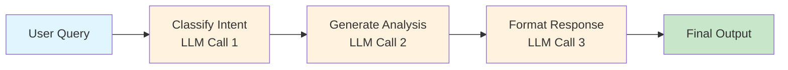

# Quick Start

Get up and running with the SpoonOS Graph System in under 2 minutes. This guide shows you how to create an LLM-powered graph workflow.

**You will learn:** how to define state, add a node, run a graph, and retrieve a checkpoint
**Best for:** first-time users
**Time to complete:** ~2 minutes

## Prerequisites

- Complete the steps in **[Getting Started / Installation](../getting-started/installation.md)**
- Import public APIs from `spoon_ai.graph` (e.g., `from spoon_ai.graph import StateGraph, END`)

## 2-Minute Hello World (no LLM)

The smallest runnable graph: one node, one edge, and a checkpoint read with `thread_id`.

```python
import asyncio
from typing import TypedDict
from spoon_ai.graph import StateGraph, END

class HelloState(TypedDict):
    name: str
    message: str

async def say_hello(state: HelloState) -> dict:
    return {"message": f"Hello, {state['name']}!"}

graph = StateGraph(HelloState)
graph.add_node("hello", say_hello)
graph.set_entry_point("hello")
graph.add_edge("hello", END)
app = graph.compile()

async def main():
    config = {"configurable": {"thread_id": "hello-demo"}}
    result = await app.invoke({"name": "Graph", "message": ""}, config=config)
    print(result["message"])  # Hello, Graph!

    # Checkpoint read: requires thread_id (captures state before node execution)
    snapshot = graph.get_state(config)
    print("checkpoint values:", snapshot.values)

if __name__ == "__main__":
    asyncio.run(main())
```

**Run it:**
```bash
python my_first_graph.py
```

## Your First LLM Graph

Here's a complete graph that uses LLM to analyze user queries:

```python
import asyncio
from typing import TypedDict, List
from spoon_ai.graph import StateGraph, END
from spoon_ai.llm import LLMManager
from spoon_ai.schema import Message

class ChatState(TypedDict):
    messages: List[dict]
    user_query: str
    llm_response: str

# Initialize LLM
llm = LLMManager()

async def analyze_query(state: ChatState) -> dict:
    """Use LLM to analyze the user query."""
    response = await llm.chat([
        Message(role="system", content="You are a helpful crypto assistant."),
        Message(role="user", content=state["user_query"])
    ])
    return {"llm_response": response.content}

# Build graph
graph = StateGraph(ChatState)
graph.add_node("analyze", analyze_query)
graph.set_entry_point("analyze")
graph.add_edge("analyze", END)
app = graph.compile()

async def main():
    result = await app.invoke({
        "messages": [],
        "user_query": "What is Bitcoin?",
        "llm_response": ""
    })
    print(result["llm_response"])

if __name__ == "__main__":
    asyncio.run(main())
```

**Run it:**
```bash
python my_first_graph.py
```

## Understanding the Code

### 1. Define Your State Schema

```python
from typing import Any, Dict, List, TypedDict


class ChatState(TypedDict):
    messages: List[Dict[str, Any]]   # Conversation history
    user_query: str                  # User input
    llm_response: str                # LLM output
```

**State** flows through your entire graph. Every node can read from it and write to it.

:::tip TypedDict Benefits
- IDE autocomplete for state fields
- Type checking to catch bugs early
- Self-documenting code
:::

### 2. Create an LLM-Powered Node

```python
import os
from typing import Any, Dict, List, TypedDict

from spoon_ai.llm import LLMManager
from spoon_ai.schema import Message


class ChatState(TypedDict, total=False):
    messages: List[Dict[str, Any]]
    user_query: str
    llm_response: str


llm = LLMManager()


async def analyze_query(state: ChatState) -> dict:
    """Use LLM to analyze the user query."""
    if os.getenv("DOC_SNIPPET_MODE") == "1":
        return {"llm_response": f"(stub) analyzed: {state.get('user_query', '')}"}

    response = await llm.chat([
        Message(role="system", content="You are a helpful crypto assistant."),
        Message(role="user", content=state["user_query"])
    ], max_tokens=200)
    return {"llm_response": response.content}
```

**Nodes** are async functions that:
- **Input**: Receive the full state dictionary
- **Process**: Call LLM, tools, or external APIs
- **Output**: Return a partial update (only changed fields)

### 3. Build and Execute

```python
from typing import Any, Dict, List, TypedDict

from spoon_ai.graph import StateGraph, END


class ChatState(TypedDict, total=False):
    messages: List[Dict[str, Any]]
    user_query: str
    llm_response: str


async def analyze_query(state: ChatState) -> dict:
    # Keep this snippet runnable without requiring an LLM key.
    return {"llm_response": f"(stub) analyzed: {state.get('user_query', '')}"}


graph = StateGraph(ChatState)
graph.add_node("analyze", analyze_query)
graph.set_entry_point("analyze")
graph.add_edge("analyze", END)
app = graph.compile()
```

**Three essential steps**:
1. Create `StateGraph` with your state schema
2. Add nodes with `.add_node(name, function)`
3. Set entry point and compile

## Multi-Step LLM Workflow

Here's a more realistic example with multiple LLM calls:

```python
import asyncio
import os
from typing import TypedDict, List
from spoon_ai.graph import StateGraph, END
from spoon_ai.llm import LLMManager
from spoon_ai.schema import Message

class AnalysisState(TypedDict):
    user_query: str
    intent: str
    analysis: str
    final_response: str

llm = LLMManager()

async def classify_intent(state: AnalysisState) -> dict:
    """LLM classifies the user's intent."""
    if os.getenv("DOC_SNIPPET_MODE") == "1":
        return {"intent": "analysis_request"}
    response = await llm.chat([
        Message(role="system", content="""Classify the user query into one of:
        - price_query: asking about price
        - analysis_request: asking for market analysis
        - general_question: other questions
        Reply with only the category name."""),
        Message(role="user", content=state["user_query"])
    ])
    return {"intent": response.content.strip().lower()}

async def generate_analysis(state: AnalysisState) -> dict:
    """LLM generates detailed analysis."""
    if os.getenv("DOC_SNIPPET_MODE") == "1":
        return {"analysis": f"(stub) analysis for: {state['user_query']}"}
    response = await llm.chat([
        Message(role="system", content="You are a crypto analyst. Provide detailed analysis."),
        Message(role="user", content=f"Analyze: {state['user_query']}")
    ])
    return {"analysis": response.content}

async def format_response(state: AnalysisState) -> dict:
    """LLM formats the final response."""
    if os.getenv("DOC_SNIPPET_MODE") == "1":
        return {"final_response": f"(stub) summary: {state.get('analysis', '')[:80]}..."}
    response = await llm.chat([
        Message(role="system", content="Format this analysis into a concise, user-friendly response."),
        Message(role="user", content=f"Intent: {state['intent']}\nAnalysis: {state['analysis']}")
    ])
    return {"final_response": response.content}

# Build graph: classify -> analyze -> format
graph = StateGraph(AnalysisState)
graph.add_node("classify", classify_intent)
graph.add_node("analyze", generate_analysis)
graph.add_node("format", format_response)

graph.set_entry_point("classify")
graph.add_edge("classify", "analyze")
graph.add_edge("analyze", "format")
graph.add_edge("format", END)

app = graph.compile()

async def main():
    result = await app.invoke({
        "user_query": "What do you think about Bitcoin's price trend?",
        "intent": "",
        "analysis": "",
        "final_response": ""
    })
    print(f"Intent: {result['intent']}")
    print(f"Response: {result['final_response']}")

if __name__ == "__main__":
    asyncio.run(main())
```

## What Just Happened?



1. User provides a query
2. First LLM call classifies the intent
3. Second LLM call generates detailed analysis
4. Third LLM call formats the response
5. Final state contains all intermediate and final results

## Quick Reference

| Component | Purpose | Example |
|-----------|---------|---------|
| `StateGraph(schema)` | Create a new graph | `graph = StateGraph(MyState)` |
| `.add_node(name, fn)` | Add an LLM-powered step | `graph.add_node("analyze", llm_fn)` |
| `.add_edge(from, to)` | Connect nodes | `graph.add_edge("a", "b")` |
| `.set_entry_point(name)` | Set starting node | `graph.set_entry_point("start")` |
| `.compile()` | Prepare for execution | `app = graph.compile()` |
| `.invoke(state)` | Run the graph | `result = await app.invoke({...})` |

## What's Next?

Now that you've built your first LLM-powered graph:

### [Core Concepts →](./core-concepts.md)
Deep dive into State, Nodes, Edges, and Checkpointing.

### [Building Graphs →](./building-graphs.md)
Learn the three API styles: Imperative, Declarative, and High-Level.

### [Examples →](./examples.md)
See practical patterns like LLM routing, parallel execution, and human-in-the-loop.
